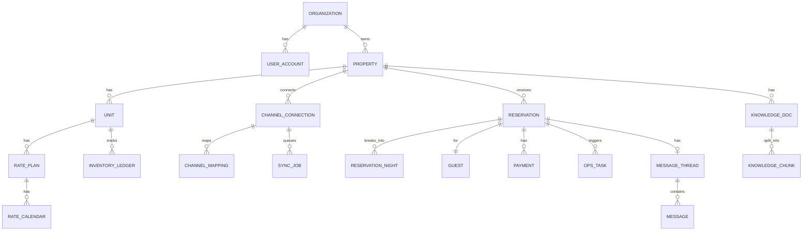

# 숙박 채널·운영 통합 관리 시스템 개발 계획서

프로젝트명: StaySync
작성일: 2026년 8월 19일
개발 기간: 2026년 8월 19일 ~ 2027년 1월 31일 (23주)
개발 인력: 1인
기술 스택: Java 21, Spring Boot 3.5, PostgreSQL 16, React 19
문서 버전: 1.2 (데이터 모델 안 B 반영, 프로젝트명 확정)

---

## 목차

1. 프로젝트 개요
2. 레퍼런스 조사
3. 구현 범위
4. 시스템 아키텍처
5. 도메인 모델과 데이터베이스
6. 채널 동기화 엔진
7. 재고 관리와 중복예약 방지
8. 기능 명세
9. AI 기능 설계
10. 외부 API 연동 계획
11. 기술 스택
12. 개발 일정
13. 주요 코드 설계
14. 테스트와 배포
15. 보안 및 법규
16. 비용 산정
17. 위험 관리
18. 산출물과 평가 기준
19. 참고자료

부록 A. 착수 체크리스트
부록 B. 지도교수 확인 사항

---

## 1. 프로젝트 개요

### 1.1 배경

숙박 사업자는 에어비앤비, 부킹닷컴, 야놀자, 여기어때, 네이버 예약 등 여러 OTA에 동일한 객실을 동시에 판매한다. 판매 채널이 늘어날수록 다음과 같은 문제가 발생한다.

중복예약이 가장 심각하다. A채널에서 판매된 객실이 B채널 달력에 반영되기 전에 다시 판매되면 취소, 플랫폼 페널티, 평점 하락으로 이어진다. 요금 관리도 문제다. 성수기 요금을 조정하려면 채널마다 개별 로그인해 수동 입력해야 한다. 게스트 문의는 채널별 메신저로 흩어져 응답 누락이 생기고, 예약부터 청소 배정, 체크인 안내까지의 운영 흐름은 메신저와 스프레드시트에 분산된다. 그 결과 채널별 실질 수익률을 파악하기 어렵다.

이 문제를 다루는 소프트웨어가 채널 관리 시스템(CMS)과 숙소 관리 시스템(PMS)이며, 최근 시장은 두 기능이 하나로 통합된 형태로 수렴하고 있다.

### 1.2 용어 정의

| 용어 | 정의 |
|---|---|
| PMS | Property Management System. 예약, 객실, 정산, 청소 등 숙소 내부 운영 관리 시스템 |
| CMS / Channel Manager | 여러 OTA에 재고, 요금, 판매 제약을 동기화하고 예약을 수집하는 중계 시스템 |
| OTA | Online Travel Agency. 에어비앤비, 부킹닷컴, 아고다, 야놀자 등 |
| ARI | Availability, Rates, Inventory. 채널매니저가 OTA에 전송하는 세 가지 핵심 데이터 |
| Rate Plan | 요금제. 같은 객실이라도 조식 포함, 환불 불가 등 판매 조건별로 분리한 단위 |
| Booking Engine | 자사 홈페이지 직접 예약 위젯 |
| iCal | RFC 5545 기반 캘린더 교환 포맷. OTA가 공개하는 예약 캘린더 URL |
| Stop Sell | 특정 날짜 판매 중지 |
| CTA / CTD | Closed To Arrival / Closed To Departure. 해당일 체크인·체크아웃 금지 |

### 1.3 목표

부업으로 자기 공간의 일부를 숙소로 내놓는 개인 호스트가 하나의 화면에서 다채널 재고, 요금, 예약, 게스트 커뮤니케이션, 운영 업무를 처리할 수 있는 웹 기반 통합 관리 시스템을 구현한다.

측정 가능한 형태로 세분하면 다음과 같다.

| 번호 | 목표 | 성공 기준 |
|---|---|---|
| G1 | 다채널 캘린더 통합 | 3개 이상 채널의 예약이 단일 캘린더에 15분 이내 반영 |
| G2 | 중복예약 차단 | 동시성 테스트 1,000회 중 중복 확정 0건 |
| G3 | 요금 일괄 관리 | 1회 입력으로 N개 채널에 요금·제약 전파, 전파 성공률 99% 이상 |
| G4 | 통합 인박스 | 채널별 메시지를 하나의 스레드로 조회·응답 |
| G5 | AI 자동 응대 | 게스트 반복 문의의 70% 이상을 사람 개입 없이 종결 |
| G6 | AI 요금 추천 | 일자별 추천가와 산출 근거를 함께 제시 |
| G7 | 운영 자동화 | 예약 확정에서 청소 태스크 생성, 담당자 알림까지 무인 처리 |

### 1.4 기술적 초점

단순 CRUD 애플리케이션과 구별되는 지점은 다음 네 가지 문제를 정면으로 다룬다는 데 있다.

첫째, 분산 시스템의 최종 일관성이다. 우리 데이터베이스와 N개 OTA의 데이터베이스 사이에서 재고 상태를 동기화해야 하며, 네트워크 지연과 실패 상황에서도 결국 수렴해야 한다.

둘째, 동시성 제어다. 여러 채널에서 동시에 들어오는 예약 요청에 대해 재고 차감의 원자성을 보장해야 한다.

셋째, 이종 프로토콜의 통합이다. 폴링 기반 iCal, 푸시 기반 REST + Webhook, 파트너 전용 API를 하나의 도메인 인터페이스로 추상화한다.

넷째, LLM의 실무 통합이다. 환각을 억제하는 검색 증강 구조와, AI가 답해서는 안 되는 질문을 사람에게 넘기는 에스컬레이션 정책이 필요하다.

---

## 2. 레퍼런스 조사

### 2.1 기능 비교

지도교수가 제시한 레퍼런스를 공개 자료 기준으로 조사한 결과는 다음과 같다.

| 기능 | mobile-calendar | Guesty | Hospitable | Hostex | Channex |
|---|---|---|---|---|---|
| 포지션 | 소형 PMS+CM | 엔터프라이즈 올인원 | 중소 호스트 특화 | 가성비 올인원 | B2B 화이트라벨 CM API |
| 연동 채널 수 | 소수 | 60+ | 5 | 9 | 61+ |
| 통합 캘린더 | 있음 | 있음 | 있음 | 있음 | 없음(API만) |
| 통합 인박스 | 없음 | 있음 | 있음 | 있음 | Messages API |
| 자동 메시징 | 예약확인 수준 | 있음 | 있음 | 있음 | 없음 |
| AI 게스트 응대 | 없음 | 없음 | 있음 | 있음(HostGPT) | 없음 |
| AI 분석 | 없음 | 없음 | Copilot | 없음 | 없음 |
| 다이나믹 프라이싱 | 없음 | 있음 | 있음 | 있음 | 없음 |
| 직접예약 사이트 | 없음 | 있음 | 있음 | 있음 | 없음 |
| 청소·태스크 | 직원 모듈 | 있음 | 있음 | 있음 | 없음 |
| 스마트락 | 없음 | 있음 | 유료 옵션 | 있음 | 없음 |
| 리뷰 관리 | 없음 | 있음 | AI 답변 | 있음 | Reviews API |
| Open API | 없음 | 있음 | 없음 | 없음 | 주력 상품 |
| 가격 | 비공개 | 3단계 | 월 $29~99 | 유닛당 $2.6~4.9 | 월 $130 + 유닛당 $0.5 |

### 2.2 조사에서 얻은 판단

Channex는 경쟁 대상이 아니라 부품으로 보는 편이 맞다. 61개 OTA와의 연동을 직접 구축하는 것은 1인 개발 6개월로는 불가능하다. 화이트라벨 채널매니저 API를 채널 어댑터 가운데 하나로 흡수하는 편이 현실적이다.

Guesty와 Hospitable의 차별점은 연동 채널 수가 아니라 운영 자동화와 AI다. 채널 수 경쟁은 자본의 문제지만 자동화 설계는 구조의 문제이므로, 후자에 집중해야 한다.

한국 시장에는 공백이 있다. Guesty와 Hospitable은 야놀자, 여기어때, 네이버 예약을 지원하지 않는다. 국내 대응 사업자는 온다(ONDA)와 오토퍼스 정도이며, 온다는 국내 최초로 에어비앤비 소프트웨어 우수 파트너로 선정된 바 있다. 이번 프로젝트에서 국내 채널을 실제로 연동하기는 어렵지만, 국내 채널을 수용하는 구조를 설계에 반영하고 문서화하는 것만으로도 의미가 있다.

### 2.3 대상 사용자

대상을 다음과 같이 좁힌다.

> 부업으로 자신이 소유했거나 임대한 공간의 일부를 숙소로 제공해 수익을 얻는 사람

이 정의에서 세 가지가 따라 나온다.

판매 단위가 곧 물리 공간이다. 오피스텔 한 채를 통째로 빌려주는 호스트에게 객실타입과 객실은 같은 것을 두 번 부르는 이름이다. 호텔에서는 "디럭스 더블"이라는 상품과 "1204호"라는 실체가 분리되지만 개인 호스트에게는 그 공간 자체가 상품이다. 이 사실이 5장의 데이터 모델을 2계층으로 정한 근거다.

채널 구성이 다르다. 개인 호스트는 에어비앤비 비중이 압도적이고 그다음이 네이버 예약과 부킹닷컴이다. 야놀자와 여기어때는 모텔과 펜션 중심이라 비중이 낮다. 에어비앤비는 리스팅 하나가 판매 단위 하나이며 iCal URL도 리스팅마다 하나씩 발급되므로, iCal 중심 전략이 이 대상에게 특히 잘 맞는다.

운영 규모가 작다. 관리 대상이 1~5개 수준이라 호실 배정이나 층별 관리 같은 호텔 운영 기능은 쓸 일이 없다. 대신 청소 배정, 무인 체크인 안내, 반복 문의 응대처럼 혼자 감당하기 번거로운 일의 자동화가 중요하다.

### 2.4 유튜브 레퍼런스에 대한 메모

제시된 유튜브 3편(JHx1GubXWgg, BQGNc1DNpC0, vE7vJrjk5LY)은 플랫폼 측 접근 제한으로 본문과 자막을 수집하지 못했다. 9장의 AI 설계는 Hospitable과 Hostex가 실제로 운영 중인 기능과 공개된 다이나믹 프라이싱 방법론을 근거로 구성했다. 영상의 제목과 핵심 주장을 확인하면 해당 장을 갱신할 예정이다.

### 2.5 포지셔닝

제품을 한 문장으로 정의하면 다음과 같다.

> 자기 공간을 부업으로 빌려주는 개인 호스트를 위한, AI가 게스트 응대와 요금 결정을 보조하는 다채널 통합 관리 시스템.

기존 서비스 대비 차별점은 두 가지다. 하나는 국내 채널을 수용할 수 있는 어댑터 구조이고, 다른 하나는 AI 응대와 요금 추천을 별도 상품이 아니라 기본 기능으로 포함한다는 점이다.

---

## 3. 구현 범위

### 3.1 범위 산정의 전제

가용 자원은 1인 23주다. 학업을 병행하므로 주당 실질 개발 시간을 20시간으로 잡으면 총 460시간이다. 이는 실무 기준 약 2.5 man-month에 해당한다. Guesty 수준의 기능을 모두 구현하는 것은 불가능하므로, 채널 동기화와 AI라는 한 축을 깊게 파고 나머지는 얕게 구현하는 전략을 취한다.

### 3.2 우선순위

MoSCoW 기법으로 분류했다.

#### Must have (약 250시간)

| ID | 기능 | 설명 |
|---|---|---|
| M1 | 인증·권한 | 회원가입, JWT 로그인, 역할(오너·매니저·청소담당) |
| M2 | 숙소·판매 단위·요금제 관리 | Property → Unit → RatePlan 계층 CRUD |
| M3 | 통합 캘린더 | 객실 × 날짜 그리드, 예약 바 표시, 드래그 이동 |
| M4 | 예약 관리 | 수기 예약 생성·수정·취소, 상세 조회, 상태 전이 |
| M5 | 채널 어댑터 추상화 계층 | ChannelAdapter 인터페이스와 3종 구현체 |
| M6 | iCal 양방향 동기화 | 폴링 기반 수신, .ics 발행 |
| M7 | Mock OTA 시뮬레이터 | OTA를 모사하는 별도 애플리케이션 |
| M8 | 재고·중복예약 방지 엔진 | 일자별 재고 원장, 락, 멱등성 |
| M9 | 요금·제약 일괄 관리 | 기간 선택 후 요금·최소숙박·판매중지 일괄 적용 |
| M10 | 채널 전파 큐 | 비동기 전파, 재시도, 실패 큐 |
| M11 | 대시보드 | 당일 체크인·아웃, 점유율, 채널별 매출 |

#### Should have (약 130시간)

| ID | 기능 | 설명 |
|---|---|---|
| S1 | AI 게스트 응대 | 검색 증강 생성 기반 답변 초안 |
| S2 | 통합 인박스 | 채널별 메시지 스레드 통합 |
| S3 | 자동 메시지 규칙 | 트리거 기반 발송 |
| S4 | AI 요금 추천 | 규칙 엔진 + 수요 신호 + 근거 설명 |
| S5 | 청소·태스크 자동화 | 체크아웃 시 태스크 자동 생성·배정 |
| S6 | 직접예약 위젯 | 임베드 예약 엔진과 결제 연동 |
| S7 | 리포트 | 채널별 ADR, RevPAR, 점유율, 순수익 |

#### Could have (약 80시간)

Channex 실연동, AI 리뷰 분석, 게스트 포털, 다국어 지원, 모바일 최적화, 스마트락 연동.

#### Won't have

이번 범위에서 제외하는 항목과 사유를 명시한다.

| 제외 항목 | 사유 |
|---|---|
| 에어비앤비·부킹닷컴 공식 파트너 API 직접 연동 | 파트너 심사에 수개월에서 1년이 소요된다. 에어비앤비는 24시간 지원 체계, 사업 규모, 데이터 정확도를 요구하며 사실상 엔터프라이즈 사업자에게만 개방한다. 다만 어댑터 인터페이스는 향후 연동을 수용하도록 설계한다 |
| 야놀자·여기어때 직접 API | B2B 제휴 계약이 필요하며 개인 개발자 대상 공개 API가 없다 |
| 회계 전표·세금계산서 연동 | 도메인 복잡도에 비해 학습 가치가 낮다 |
| 네이티브 모바일 앱 | 반응형 웹으로 대체한다 |
| 멀티테넌시 과금 | 데모 목적상 불필요하다 |

### 3.3 채널 연동 전략

세 가지 접근을 모두 채택하되, 하나의 인터페이스 뒤에 감춘다.

```
                    ┌──────────────────────────┐
                    │   ChannelSyncService     │
                    │   (도메인 로직)            │
                    └────────────┬─────────────┘
                                 │ ChannelAdapter
          ┌──────────────────────┼──────────────────────┐
          │                      │                      │
┌─────────▼────────┐  ┌──────────▼─────────┐  ┌────────▼──────────┐
│ ICalAdapter      │  │ ChannexAdapter     │  │ MockOtaAdapter    │
│                  │  │                    │  │                   │
│ 수신: 15분 폴링    │  │ 송신: REST ARI     │  │ 실제 OTA 모사       │
│ 발신: .ics 발행   │  │ 수신: Webhook      │  │ 지연·실패 주입 가능  │
│ 날짜만 동기화      │  │ 요금·제약까지       │  │ 통합 테스트용        │
│ 무료, 즉시 가능    │  │ 월 $130부터        │  │                   │
└──────────────────┘  └────────────────────┘  └───────────────────┘
```

각 접근의 역할은 다음과 같다.

iCal은 실사용 가능한 최소 기능을 담당한다. 별도 승인 절차 없이 실제 에어비앤비 계정과 연동할 수 있는 유일한 무료 경로이므로, 실제 데이터로 시연할 수 있다.

Channex는 상용 채널매니저 API의 레퍼런스 역할을 한다. 실제 ARI 전송과 웹훅 예약 수신을 경험함으로써 어댑터 인터페이스가 실제 API 형태를 견디는지 검증한다. 문서에 테스트 샌드박스 제공이 명시되어 있으므로 유료 구독 전에 샌드박스를 먼저 요청한다.

Mock 시뮬레이터는 아키텍처 검증 도구다. iCal은 요금을 동기화하지 못하고 Channex는 유료 계정이 필요하므로, 두 방식으로는 검증할 수 없는 조건이 남는다. 지연, 실패, 중복 전송, 순서 역전, 동시 예약을 의도적으로 주입해 재시도와 멱등성, 중복예약 방지 로직을 정량적으로 검증한다.

이 구성의 의미는 특정 OTA와 연동했다는 데 있지 않고, OTA 연동이라는 문제를 푸는 구조를 만들고 그 구조가 서로 다른 세 종류의 프로토콜에서 동작함을 확인한다는 데 있다.

### 3.4 iCal 방식의 구조적 한계

| 항목 | iCal | 공식 API |
|---|---|---|
| 동기화 지연 | 수십 분에서 2시간 | 즉시 |
| 동기화 대상 | 예약된 날짜 블록만 | 요금, 재고, 제약, 메시지, 게스트 정보 |
| 게스트 정보 | 없음 | 전체 |
| 요금 전송 | 불가 | 가능 |
| 중복예약 위험 | 높음 | 낮음 |
| 진입 비용 | 없음 | 파트너 심사 수개월 |

따라서 시스템은 iCal의 지연을 전제로 한 방어 설계를 포함해야 한다. 구체적으로는 채널별 재고 버퍼, 충돌 감지 후 해소 절차, 정기 전수 대조 배치의 세 가지이며 7장에서 다룬다. 이 트레이드오프 분석 자체가 프로젝트의 검토 대상이 된다.

---

## 4. 시스템 아키텍처

### 4.1 아키텍처 스타일

모듈러 모놀리스와 비동기 워커의 조합을 채택했다. 검토 과정은 다음과 같다.

마이크로서비스는 1인 개발에서 운영 부담이 지나치다. 서비스 디스커버리, 분산 트랜잭션, 십여 개의 컨테이너 관리가 개발 시간을 잠식한다.

단순 레이어드 모놀리스는 채널 어댑터와 AI 모듈의 경계가 흐려져 확장이 어렵다.

모듈러 모놀리스는 배포 단위를 하나로 유지하면서 패키지 경계로 모듈을 격리한다. Spring Modulith를 사용하면 경계 위반을 테스트 시점에 자동 검증할 수 있다.

### 4.2 전체 구성

```
┌────────────────────────────────────────────────────────────────────┐
│ 클라이언트                                                           │
│  ┌──────────────────┐  ┌──────────────────┐  ┌──────────────────┐  │
│  │ 관리자 웹 (React) │  │ 직접예약 위젯     │  │ 게스트 포털       │  │
│  └────────┬─────────┘  └────────┬─────────┘  └────────┬─────────┘  │
└───────────┼─────────────────────┼─────────────────────┼────────────┘
            │  HTTPS / REST + SSE │                     │
┌───────────▼─────────────────────▼─────────────────────▼────────────┐
│ Spring Boot 애플리케이션                                             │
│                                                                     │
│  ┌────────────── Web Layer (Controller / DTO / Validation) ───────┐ │
│  └────────────────────────────┬───────────────────────────────────┘ │
│                               │                                     │
│  ┌──────────┐ ┌──────────┐ ┌─▼────────┐ ┌──────────┐ ┌──────────┐  │
│  │ identity │ │ property │ │ booking  │ │ channel  │ │ ai       │  │
│  └──────────┘ └──────────┘ └────┬─────┘ └────┬─────┘ └────┬─────┘  │
│  ┌──────────┐ ┌──────────┐ ┌────▼─────┐ ┌────▼─────┐ ┌────▼─────┐  │
│  │ messaging│ │ ops      │ │ pricing  │ │ payment  │ │ analytics│  │
│  └──────────┘ └──────────┘ └──────────┘ └──────────┘ └──────────┘  │
│                                                                     │
│  ┌────────── Shared Kernel (Event Bus, Outbox, Lock, Audit) ──────┐ │
│  └─────────────────────────────────────────────────────────────────┘ │
└───────┬───────────────────┬───────────────────┬────────────────────┘
        │                   │                   │
┌───────▼──────┐    ┌───────▼──────┐    ┌───────▼───────────────────┐
│ PostgreSQL 16│    │ Redis 7      │    │ 비동기 워커                 │
│ + pgvector   │    │ 분산 락·캐시  │    │ ChannelSyncWorker         │
│              │    │              │    │ ICalPollScheduler         │
│              │    │              │    │ OutboxRelay               │
└──────────────┘    └──────────────┘    │ AutoMessageScheduler      │
                                        └───────────┬───────────────┘
                                                    │
        ┌───────────────────────┬───────────────────┼─────────────────┐
        │                       │                   │                 │
┌───────▼───────┐   ┌───────────▼──────┐  ┌─────────▼──────┐ ┌───────▼──────┐
│ OTA iCal URLs │   │ Channex REST API │  │ Mock OTA Sim   │ │ LLM API      │
└───────────────┘   └──────────────────┘  └────────────────┘ └──────────────┘
```

### 4.3 모듈 경계

| 모듈 | 책임 | 의존 허용 |
|---|---|---|
| identity | 계정, 조직, 역할, 인증 토큰 | 없음 |
| property | 숙소, 판매 단위, 요금제, 편의시설, 사진 | identity |
| booking | 예약 애그리게이트, 재고 원장, 상태 전이 | property |
| pricing | 요금 캘린더, 판매 제약, 요금 규칙 | property |
| channel | 채널 연결, 어댑터, 동기화 큐, 매핑 | booking·pricing의 이벤트만 |
| messaging | 스레드, 메시지, 자동 발송 규칙 | booking의 이벤트만 |
| ops | 청소·점검 태스크, 담당자 배정 | booking의 이벤트만 |
| payment | 결제, 환불, 채널 수수료 기록 | booking |
| ai | 지식 인덱스, 답변 생성, 요금 추천 | 이벤트와 읽기 전용 뷰만 |
| analytics | 지표 집계, 리포트 | 읽기 전용 뷰만 |

모듈 간 직접 호출은 금지한다. 발행된 도메인 이벤트 또는 공개된 포트 인터페이스만 사용한다. 이 규칙은 다음 테스트로 강제한다.

```java
@Test
void 모듈_경계를_위반하지_않는다() {
    ApplicationModules.of(StaySyncApplication.class).verify();
}
```

### 4.4 이벤트 전달 방식

채널 동기화, AI, 알림은 모두 도메인 이벤트로 트리거된다. 데이터베이스 트랜잭션과 외부 호출의 원자성을 보장하기 위해 Transactional Outbox 패턴을 사용한다.

```
[예약 확정 트랜잭션]
  ├─ reservation      INSERT
  ├─ inventory_ledger UPDATE (재고 −1)
  └─ outbox_event     INSERT        ← 동일 트랜잭션에서 커밋

        ↓ 커밋 후 별도 스레드

[OutboxRelay 폴링 · 1초 주기]
  └─ 미발행 이벤트 조회
       ├─→ ChannelSyncWorker : 각 채널에 재고 반영
       ├─→ OpsWorker         : 청소 태스크 생성
       ├─→ MessagingWorker   : 예약 확인 메시지 발송
       └─ 성공 시 published_at 기록, 실패 시 retry_count 증가
```

예약 저장 직후 채널 API 호출이 실패하는 경우를 생각해 보자. 트랜잭션 안에서 외부를 호출하면 롤백되지 않고, 트랜잭션 밖에서 호출하면 이벤트가 유실된다. Outbox는 데이터 기록과 이벤트 기록을 한 트랜잭션으로 묶어 최소 1회 전달을 보장하며, 중복 전달은 멱등성 키로 흡수한다.

---

## 5. 도메인 모델과 데이터베이스

### 5.1 애그리게이트 구조

판매 단위(Unit)가 이 모델의 중심이다. 객실타입과 개별 객실을 나누지 않고 하나로 합쳤는데, 대상 사용자인 개인 호스트에게는 판매 상품이 곧 물리 공간이라 두 계층이 항상 1:1이 되기 때문이다. 도미토리처럼 같은 조건의 자리를 여러 개 파는 경우는 `Unit.total_units`로 표현한다. 선택 근거와 대안 비교는 별도 문서 `결정문서-01-데이터모델.md`에 있다.

```
Organization
   └── Property
         ├── Unit                      판매 단위이자 물리 공간
         │     ├── RatePlan
         │     │     └── RateCalendar
         │     └── InventoryLedger     일자별 재고
         ├── ChannelConnection
         │     └── ChannelMapping
         └── Reservation
               ├── ReservationNight
               ├── Guest
               └── Payment
```

### 5.2 개체 관계도



### 5.3 주요 테이블 정의

전체 스키마는 `staysync/src/main/resources/db/migration/postgresql/V1__init.sql`에 있고, PostgreSQL 16에서 실행해 제약이 의도대로 동작하는지 확인했다. 여기에는 설계 판단이 담긴 세 테이블만 옮긴다. 문서와 코드에 같은 SQL을 두 벌 두면 반드시 어긋나므로, 나머지는 마이그레이션 파일을 정본으로 삼는다.

**판매 단위** — 객실타입과 개별 객실을 합친 결과다. `total_units`가 수량을 담고, 독채는 1, 4인 도미토리는 4가 된다. `unit_kind`는 에어비앤비의 숙소 유형 구분과 대응시켜 두었으며 나중에 채널 매핑과 요금 추천의 입력으로 쓸 수 있다.

```sql
CREATE TABLE unit (
    id             BIGSERIAL PRIMARY KEY,
    property_id    BIGINT NOT NULL REFERENCES property(id) ON DELETE CASCADE,
    name           VARCHAR(200) NOT NULL,        -- "성수동 오피스텔", "작은방"
    unit_kind      VARCHAR(20)  NOT NULL,
    occupancy_std  SMALLINT NOT NULL DEFAULT 2,
    occupancy_max  SMALLINT NOT NULL DEFAULT 4,
    total_units    SMALLINT NOT NULL DEFAULT 1,  -- 독채는 1, 도미토리는 침대 수
    base_price     NUMERIC(12,2) NOT NULL DEFAULT 0,
    floor_price    NUMERIC(12,2),                -- 요금 추천 하한
    ceiling_price  NUMERIC(12,2),                -- 요금 추천 상한
    housekeeping   VARCHAR(20) NOT NULL DEFAULT 'CLEAN',
    sort_order     SMALLINT NOT NULL DEFAULT 0,
    created_at     TIMESTAMPTZ NOT NULL DEFAULT now(),
    CONSTRAINT chk_unit_kind CHECK (unit_kind IN ('ENTIRE_PLACE','PRIVATE_ROOM','SHARED_ROOM')),
    CONSTRAINT chk_unit_total CHECK (total_units >= 1),
    CONSTRAINT chk_unit_occupancy CHECK (occupancy_max >= occupancy_std)
);
```

**재고 원장** — 중복예약 방지의 기준 테이블이다. `chk_no_oversell`이 방어 3계층에 해당하며, 애플리케이션 로직에 결함이 있어도 초과 판매된 행 자체가 저장되지 않는다.

```sql
CREATE TABLE inventory_ledger (
    unit_id      BIGINT   NOT NULL REFERENCES unit(id) ON DELETE CASCADE,
    stay_date    DATE     NOT NULL,
    total_units  SMALLINT NOT NULL,
    booked_units SMALLINT NOT NULL DEFAULT 0,
    held_units   SMALLINT NOT NULL DEFAULT 0,
    stop_sell    BOOLEAN  NOT NULL DEFAULT false,
    version      BIGINT   NOT NULL DEFAULT 0,
    updated_at   TIMESTAMPTZ NOT NULL DEFAULT now(),
    PRIMARY KEY (unit_id, stay_date),
    CONSTRAINT chk_no_oversell CHECK (booked_units + held_units <= total_units),
    CONSTRAINT chk_non_negative CHECK (booked_units >= 0 AND held_units >= 0)
);
```

**예약** — 주목할 부분은 `uq_channel_booking`이다. 채널 코드와 채널 예약번호의 조합을 유일하게 만들어, 같은 예약이 웹훅으로 여러 번 전달되어도 중복 생성되지 않는다. `revision`은 OTA에서 수정된 예약이 순서가 뒤바뀌어 도착했을 때 낮은 버전을 무시하기 위한 값이다.

```sql
CREATE TABLE reservation (
    id                 BIGSERIAL PRIMARY KEY,
    property_id        BIGINT NOT NULL REFERENCES property(id),
    unit_id            BIGINT NOT NULL REFERENCES unit(id),
    rate_plan_id       BIGINT REFERENCES rate_plan(id),
    guest_id           BIGINT REFERENCES guest(id),
    channel_code       VARCHAR(40) NOT NULL,
    channel_booking_id VARCHAR(120),
    confirmation_code  VARCHAR(20) NOT NULL,
    status             VARCHAR(20) NOT NULL,
    check_in           DATE NOT NULL,
    check_out          DATE NOT NULL,
    adults             SMALLINT NOT NULL DEFAULT 2,
    children           SMALLINT NOT NULL DEFAULT 0,
    total_amount       NUMERIC(12,2) NOT NULL DEFAULT 0,
    channel_commission NUMERIC(12,2) NOT NULL DEFAULT 0,
    net_amount         NUMERIC(12,2) GENERATED ALWAYS AS
                       (total_amount - channel_commission) STORED,
    raw_payload        JSONB,
    revision           INT NOT NULL DEFAULT 1,
    hold_expires_at    TIMESTAMPTZ,
    created_at         TIMESTAMPTZ NOT NULL DEFAULT now(),
    updated_at         TIMESTAMPTZ NOT NULL DEFAULT now(),
    CONSTRAINT uq_confirmation UNIQUE (confirmation_code),
    CONSTRAINT uq_channel_booking UNIQUE (channel_code, channel_booking_id),
    CONSTRAINT chk_res_dates CHECK (check_out > check_in),
    CONSTRAINT chk_res_status CHECK (status IN
        ('HOLD','CONFIRMED','CANCELLED','CHECKED_IN','CHECKED_OUT','NO_SHOW','EXPIRED'))
);
```

나머지 테이블은 목록으로만 적는다. 요금제(`rate_plan`), 요금 캘린더(`rate_calendar`), 게스트(`guest`), 박별 스냅샷(`reservation_night`), 결제(`payment`), 채널 연결(`channel_connection`), 채널 매핑(`channel_mapping`), 동기화 큐(`sync_job`), 이벤트 발행함(`outbox_event`), 충돌 기록(`overbooking_conflict`), 운영 태스크(`ops_task`), 메시지 스레드와 메시지(`message_thread`, `message`), 지식 문서와 청크(`knowledge_doc`, `knowledge_chunk`), 감사 로그(`audit_log`), 스케줄 락(`shedlock`).


### 5.4 예약 상태 전이

```
                   ┌──────────┐
      직접예약 시작 →│   HOLD   │─── 15분 미결제 ──→ EXPIRED
                   └────┬─────┘
                        │ 결제 성공 또는 OTA 예약 수신
                        ▼
     ┌────────────┐ ┌──────────────┐ ┌────────────┐
     │ CANCELLED  │◄│  CONFIRMED   │→│ NO_SHOW    │
     └────────────┘ └──────┬───────┘ └────────────┘
            ▲              │ 체크인 처리
            │              ▼
            │       ┌──────────────┐
            └───────│  CHECKED_IN  │
                    └──────┬───────┘
                           │ 체크아웃 처리
                           ▼
                    ┌──────────────┐
                    │ CHECKED_OUT  │──→ 리뷰 요청, 정산 확정
                    └──────────────┘
```

상태 전이에 따른 재고 영향은 다음과 같다.

| 전이 | held_units | booked_units |
|---|---|---|
| 신규 HOLD | +1 | 0 |
| HOLD → CONFIRMED | −1 | +1 |
| HOLD → EXPIRED | −1 | 0 |
| OTA 예약 직접 수신 | 0 | +1 |
| CONFIRMED → CANCELLED | 0 | −1 |
| CONFIRMED → CHECKED_IN/OUT | 0 | 변화 없음 |

---

## 6. 채널 동기화 엔진

### 6.1 어댑터 인터페이스

모든 채널이 따르는 공통 계약을 정의한다.

```java
package com.staysync.channel.port;

public interface ChannelAdapter {

    AdapterType type();

    /** 이 어댑터가 실제로 지원하는 기능 */
    Set<Capability> capabilities();

    // 우리 → 채널
    SyncResult pushAri(ChannelConnection conn, AriUpdateCommand cmd);

    default Optional<String> exportCalendar(ChannelConnection conn, Long unitId) {
        return Optional.empty();
    }

    // 채널 → 우리
    default List<InboundBooking> pullBookings(ChannelConnection conn, DateRange range) {
        return List.of();
    }

    default List<InboundBooking> parseWebhook(ChannelConnection conn,
                                              String rawBody,
                                              Map<String,String> headers) {
        return List.of();
    }

    default boolean verifySignature(ChannelConnection conn,
                                    String rawBody,
                                    Map<String,String> headers) {
        return true;
    }

    enum Capability {
        PUSH_AVAILABILITY, PUSH_RATE, PUSH_RESTRICTION,
        PULL_BOOKING, WEBHOOK_BOOKING, MESSAGING, REVIEW, CONTENT
    }
    enum AdapterType { ICAL, CHANNEX, MOCK }
}
```

`capabilities()`로 기능을 런타임에 확인하는 것이 이 설계의 요점이다. iCal 어댑터는 `PUSH_RATE`를 지원하지 않으므로 사용자가 요금을 변경해도 해당 채널에는 전파 작업을 만들지 않고, 화면에 지원하지 않는다는 표시를 남긴다. 향후 에어비앤비 공식 API 어댑터를 추가하면 기존 코드를 고치지 않고 기능이 열린다.

### 6.2 iCal 어댑터

수신 절차는 다음과 같다.

스케줄러가 15분마다 활성화된 iCal 연결을 조회하고 HTTP GET을 수행한다. ETag와 Last-Modified 헤더를 캐싱해 불필요한 파싱을 피하고, 타임아웃은 10초, 재시도는 지수 백오프로 3회 수행한다. ical4j로 VEVENT를 파싱해 UID를 채널 예약번호로, DTSTART와 DTEND를 체크인·체크아웃 날짜로 매핑한다. DTEND는 exclusive이므로 그대로 체크아웃일로 사용한다.

이후 직전 상태와 비교해 신규 UID는 예약으로 생성하고, 날짜가 바뀐 UID는 수정하며, 사라진 UID는 취소로 처리한다. 다만 파싱 실패나 일시적 오류로 응답이 비었을 때 전체 예약이 취소되는 사고를 막기 위해, 이번 응답의 이벤트 수가 직전 대비 절반 이하로 줄면 취소 처리를 보류하고 관리자에게 알린다.

발행은 `GET /public/ical/{token}.ics` 형태로 제공한다. 토큰은 추측 불가능한 난수이며 URL 자체가 인증 역할을 한다. 확정 예약과 수동 블록을 VEVENT로 출력하고 5분 캐시를 건다.

### 6.3 Channex 어댑터

Channex는 JSON REST와 웹훅 구조이며 Properties, Room Types, Rate Plans, ARI, Bookings, Channels, Photos, Hotel Policy, Facilities, Taxes, Webhooks, Messages, Reviews, Availability Rules 등의 객체를 제공한다.

ARI 전송 요청은 다음 형태다.

```json
POST /api/v1/restrictions
{
  "values": [
    {
      "property_id": "5c5d8dcb-...",
      "rate_plan_id": "a1b2c3d4-...",
      "date_from": "2026-12-24",
      "date_to":   "2026-12-26",
      "rate": 250000,
      "min_stay_arrival": 2,
      "closed_to_arrival": false,
      "stop_sell": false
    }
  ]
}
```

지원하는 제약은 rate, min_stay, min_stay_arrival, min_stay_through, max_stay, closed_to_arrival, closed_to_departure, stop_sell이다.

요청 한도 대응이 설계에 반드시 반영되어야 한다. Channex는 분당 총 20건, 숙소당 분당 10건(요금·제약), 숙소당 분당 10건(재고)으로 제한하며 초과 시 429를 반환한다. 문서는 변경사항을 모아 6초마다 한 번 호출하는 방식을 권장한다.

```java
@Component
public class AriCoalescingBuffer {

    private final Map<Long, NavigableMap<LocalDate, AriDelta>> buffer
            = new ConcurrentHashMap<>();

    public void enqueue(Long connectionId, LocalDate date, AriDelta delta) {
        buffer.computeIfAbsent(connectionId, k -> new ConcurrentSkipListMap<>())
              .merge(date, delta, AriDelta::mergeLatestWins);
    }

    @Scheduled(fixedDelay = 6000)
    public void flush() {
        buffer.forEach((connId, deltas) -> {
            if (deltas.isEmpty()) return;
            var batch = compressToDateRanges(deltas);
            syncJobService.enqueue(connId, JobType.PUSH_ARI, batch);
            deltas.clear();
        });
    }
}
```

변경 병합과 날짜 구간 압축을 함께 적용하면, 캘린더에서 30일을 드래그해 요금을 바꿔도 채널당 API 호출이 1회로 끝난다. 순진하게 구현할 경우 30일 × 3채널 = 90회 호출이 발생해 요청 한도에 걸린다.

웹훅은 서명을 검증한 뒤 202를 즉시 반환하고, 실제 처리는 동기화 큐에 적재해 워커가 수행한다. 웹훅 핸들러에서 동기 처리를 하면 채널 측 타임아웃과 재전송을 유발한다.

### 6.4 Mock OTA 시뮬레이터

별도의 Spring Boot 애플리케이션으로 구현한다. 실제 OTA에서 발생하지만 재현하기 어려운 악조건을 만들어 내는 것이 목적이다.

| 기능 | 검증 대상 |
|---|---|
| ARI 수신 엔드포인트 | 정상 전송 경로 |
| 예약 목록 조회 | 폴링 수신 경로 |
| 웹훅 발신 | 푸시 수신 경로 |
| 지연 주입 | 타임아웃과 서킷브레이커 |
| 에러율 주입 | 재시도와 백오프 |
| 동일 예약 중복 전송 | 멱등성 |
| 동시 예약 다발 | 중복예약 방지 |
| revision 순서 역전 | 버전 기반 충돌 해소 |
| 전송한 ARI 무시 | 재동기화 배치 |

```java
@Component
@Order(1)
public class ChaosFilter implements Filter {

    @Value("${chaos.latency-ms:0}")   long   latencyMs;
    @Value("${chaos.error-rate:0.0}") double errorRate;

    @Override
    public void doFilter(ServletRequest req, ServletResponse res, FilterChain chain)
            throws IOException, ServletException {
        if (latencyMs > 0) sleep(latencyMs);
        if (ThreadLocalRandom.current().nextDouble() < errorRate) {
            ((HttpServletResponse) res).sendError(503, "Chaos: injected failure");
            return;
        }
        chain.doFilter(req, res);
    }
}
```

### 6.5 동기화 파이프라인

송신 경로는 다음과 같다.

```
사용자가 캘린더에서 12/24~12/26 요금 25만원 설정
      │
      ▼
RateCalendarService.bulkUpdate()  ── 트랜잭션 ──┐
      ├─ rate_calendar UPSERT                  │
      └─ outbox_event INSERT (RateChanged)     │
                                          커밋 ┘
      │
      ▼ OutboxRelay
ChannelSyncService.onRateChanged()
      ├─ 해당 판매 단위에 매핑된 활성 연결 조회
      ├─ capabilities() 확인, PUSH_RATE 미지원이면 제외
      └─ AriCoalescingBuffer.enqueue()
      │
      ▼ 6초 후 flush
sync_job (PUSH_ARI, idempotency_key = hash(connId, dateRange, values))
      │
      ▼ SyncJobWorker
adapter.pushAri()
      ├─ 성공 → SUCCESS, last_sync_at 갱신
      ├─ 429  → next_run_at = now + 60s
      ├─ 5xx  → 지수 백오프 (최대 30분)
      └─ 8회 초과 → DEAD, 관리자 알림
```

수신 경로는 다음과 같다.

```
(a) iCal 폴링   (b) Channex 웹훅   (c) Mock 웹훅
      └──────────────┬──────────────┘
                     ▼
           InboundBooking (표준 DTO)
                     │
                     ▼
      BookingIngestService.ingest()
         ├─ 1. 멱등성 검사: (channel_code, channel_booking_id)
         │      ├─ 없음        → 신규 생성
         │      ├─ revision 동일 → 무시
         │      └─ revision 증가 → 수정
         ├─ 2. 재고 락 획득
         ├─ 3. 재고 검증
         │      ├─ 충분 → 예약 확정
         │      └─ 부족 → 충돌 기록 후 알림
         ├─ 4. 예약 저장 + outbox_event
         └─ 5. 다른 채널로 재고 차감 전파
```

### 6.6 정기 재동기화

분산 동기화는 언제든 어긋날 수 있다. 매일 새벽 4시에 향후 180일 구간을 전수 대조하는 배치를 둔다.

```java
@Scheduled(cron = "0 0 4 * * *", zone = "Asia/Seoul")
public void reconcileAll() {
    for (ChannelConnection conn : connectionRepo.findActive()) {
        var range = DateRange.of(LocalDate.now(), LocalDate.now().plusDays(180));

        var ours   = inventoryService.snapshot(conn.getPropertyId(), range);
        var theirs = adapterRegistry.get(conn).fetchAriSnapshot(conn, range);

        var diffs = AriDiff.compare(ours, theirs);
        if (!diffs.isEmpty()) {
            log.warn("[RECONCILE] conn={} diffs={}", conn.getId(), diffs.size());
            diffs.forEach(d -> ariBuffer.enqueue(conn.getId(), d.date(), d.toDelta()));
            alertService.notifyDrift(conn, diffs);
        }
        metrics.gauge("channel.drift.count", diffs.size(),
                      "channel", conn.getChannelCode());
    }
}
```

이 배치의 효과는 Mock 시뮬레이터에 일정 에러율을 주입한 상태로 며칠간 운영해 불일치 누적량을 측정하는 방식으로 검증한다. 배치 적용 전후의 누적 불일치 건수를 비교해 수렴 여부를 확인하는 것이 목표이며, 구체적인 수치는 실측 후 기록한다.

---

## 7. 재고 관리와 중복예약 방지

### 7.1 문제 상황

```
T+0ms  12/25 잔여 1실
T+0ms  채널A 예약 요청 도착 (스레드1) → 재고 조회 1 → 판매 가능
T+2ms  채널B 예약 요청 도착 (스레드2) → 재고 조회 1 → 판매 가능
T+5ms  스레드1 커밋 → booked = 1
T+7ms  스레드2 커밋 → booked = 2   ← 중복예약
```

### 7.2 방어 계층

네 개의 계층을 둔다.

| 계층 | 방식 | 차단 대상 |
|---|---|---|
| 1 | Redis 분산 락 (Redisson) | 애플리케이션 인스턴스 간 동시 진입 |
| 2 | `SELECT ... FOR UPDATE`, 날짜 오름차순 획득 | 데이터베이스 수준 동시 갱신, 교착 상태 |
| 3 | `CHECK (booked_units + held_units <= total_units)` | 로직 결함이 통과했을 때의 최종 차단 |
| 4 | 충돌 감지 및 해소 절차 | iCal 지연 등 원천 차단이 불가능한 경우 |

2계층에서 날짜 순서를 지키는 것이 중요하다. 스레드1이 12/25 → 12/26 순으로, 스레드2가 12/26 → 12/25 순으로 락을 획득하면 교착 상태가 발생한다.

### 7.3 재고 차감 구현

```java
@Service
@RequiredArgsConstructor
public class InventoryService {

    private final InventoryLedgerRepository ledgerRepo;
    private final RedissonClient redisson;

    @Transactional
    public void reserve(Long unitId, LocalDate checkIn, LocalDate checkOut, int units) {
        List<LocalDate> nights = checkIn.datesUntil(checkOut).sorted().toList();

        RLock lock = redisson.getLock("lock:inv:" + unitId);
        boolean acquired;
        try {
            acquired = lock.tryLock(3, 10, TimeUnit.SECONDS);
        } catch (InterruptedException e) {
            Thread.currentThread().interrupt();
            throw new LockAcquisitionException(e);
        }
        if (!acquired) throw new LockAcquisitionException("inventory lock timeout");

        try {
            List<InventoryLedger> rows = ledgerRepo.findForUpdate(unitId, nights);
            if (rows.size() != nights.size()) {
                autoCreateMissingLedgerRows(unitId, nights, rows);
                rows = ledgerRepo.findForUpdate(unitId, nights);
            }

            for (InventoryLedger row : rows) {
                if (row.isStopSell()) {
                    throw new InsufficientInventoryException(row.getStayDate(), "STOP_SELL");
                }
                int available = row.getTotalUnits() - row.getBookedUnits() - row.getHeldUnits();
                if (available < units) {
                    throw new InsufficientInventoryException(row.getStayDate(), "SOLD_OUT");
                }
                row.book(units);
            }
            ledgerRepo.saveAll(rows);

        } finally {
            if (lock.isHeldByCurrentThread()) lock.unlock();
        }
    }
}
```

```java
public interface InventoryLedgerRepository
        extends JpaRepository<InventoryLedger, InventoryId> {

    @Lock(LockModeType.PESSIMISTIC_WRITE)
    @QueryHints(@QueryHint(name = "jakarta.persistence.lock.timeout", value = "3000"))
    @Query("""
        select l from InventoryLedger l
        where l.unitId = :unitId and l.stayDate in :dates
        order by l.stayDate asc
        """)
    List<InventoryLedger> findForUpdate(@Param("unitId") Long unitId,
                                        @Param("dates") List<LocalDate> dates);
}
```

### 7.4 차단할 수 없는 경우의 처리

iCal은 최대 2시간까지 지연될 수 있다. 이미 판매된 객실을 우리가 모르는 구간이 구조적으로 존재한다는 뜻이다. 이 경우는 차단이 아니라 빠른 발견과 처리가 답이다.

```sql
CREATE TABLE overbooking_conflict (
    id              BIGSERIAL PRIMARY KEY,
    property_id     BIGINT NOT NULL,
    unit_id    BIGINT NOT NULL,
    stay_date       DATE NOT NULL,
    reservation_ids BIGINT[] NOT NULL,
    detected_at     TIMESTAMPTZ NOT NULL DEFAULT now(),
    severity        VARCHAR(10) NOT NULL,
    status          VARCHAR(20) NOT NULL DEFAULT 'OPEN',
    resolution      VARCHAR(40),
    resolved_by     BIGINT,
    resolved_at     TIMESTAMPTZ,
    memo            TEXT
);
```

관리 화면에서는 충돌한 예약 목록과 함께 네 가지 해소 방법을 제시한다. 여유 있는 상위 판매 단위으로 업그레이드 배정, 인근 제휴 숙소 안내, 예약 취소 및 보상 정책 적용, 실제 추가 객실이 있는 경우 관리자 판단에 따른 허용이다. 선택한 방법에 맞는 게스트 안내 메시지 초안은 9장의 AI 기능이 생성한다.

예방적 조치로 채널별 재고 버퍼를 둔다.

```java
int exposedUnits = switch (adapterType) {
    case CHANNEX, MOCK -> availableUnits;                   // 실시간 반영
    case ICAL          -> Math.max(0, availableUnits - 1);  // 지연형은 1실 유보
};
```

마지막 1실이 남았을 때 iCal 채널에서는 판매를 중지하므로 중복예약 확률이 크게 줄어든다. 대신 판매 기회를 잃으므로 숙소별로 켜고 끌 수 있게 한다. 이 트레이드오프를 데이터로 분석하는 것도 프로젝트의 검토 항목이다.

### 7.5 동시성 검증

```java
@SpringBootTest
@Testcontainers
class OverbookingConcurrencyTest {

    @Container static PostgreSQLContainer<?> pg =
            new PostgreSQLContainer<>("postgres:16");
    @Container static GenericContainer<?> redis =
            new GenericContainer<>("redis:7-alpine").withExposedPorts(6379);

    @Test
    void 재고_1개에_동시요청_100건이_들어와도_1건만_성공한다() throws Exception {
        Long unitId = fixture.createUnit(1);
        LocalDate in = LocalDate.of(2026, 12, 25), out = in.plusDays(1);

        int threads = 100;
        var latch   = new CountDownLatch(1);
        var success = new AtomicInteger();
        var failure = new AtomicInteger();

        try (var pool = Executors.newFixedThreadPool(32)) {
            for (int i = 0; i < threads; i++) {
                pool.submit(() -> {
                    try {
                        latch.await();
                        inventoryService.reserve(unitId, in, out, 1);
                        success.incrementAndGet();
                    } catch (InsufficientInventoryException
                             | LockAcquisitionException e) {
                        failure.incrementAndGet();
                    }
                });
            }
            latch.countDown();
        }

        assertThat(success.get()).isEqualTo(1);
        assertThat(failure.get()).isEqualTo(99);
        assertThat(ledgerRepo.find(unitId, in).getBookedUnits()).isEqualTo(1);
    }
}
```

이 테스트는 동시성을 고려했다는 진술을 검증된 사실로 바꾼다. 결과는 최종 보고서에 첨부한다.

---

## 8. 기능 명세

### 8.1 화면 구성

```
/login, /signup
/dashboard                     대시보드
/calendar                      통합 캘린더
/reservations                  예약 목록
/reservations/:id              예약 상세
/inbox                         통합 인박스
/inbox/:threadId               대화 스레드
/rates                         요금·제약 관리
/rates/rules                   요금 규칙, AI 추천
/properties                    숙소 목록
/properties/:id/units          판매 단위·요금제 설정
/properties/:id/knowledge      AI 지식베이스
/channels                      채널 연결 목록
/channels/:id/mapping          객실 매핑 설정
/channels/:id/logs             동기화 로그, 충돌 내역
/ops/tasks                     청소·정비 태스크
/reports                       리포트
/settings/*                    설정

/book/:propertySlug            직접예약 위젯 (공개)
/g/:token                      게스트 포털 (공개)
/public/ical/:token.ics        iCal 발행 (공개)
```

### 8.2 통합 캘린더

가장 먼저 구현할 화면이다. 좌측에 판매 단위 목록을, 상단에 날짜 헤더를 고정하고 본문에 가상 스크롤 그리드를 배치한다. 판매 단위가 곧 물리 공간이므로 계층 없이 한 줄에 하나씩 놓는다. 기본 30일을 표시하고 최대 365일까지 가로로 확장한다.

각 셀은 잔여 재고, 요금, 최소숙박 표시, 판매중지 여부를 담는다. 예약은 막대로 표시하며 채널별로 색을 구분하고 좌우 드래그로 날짜를 변경할 수 있다. 셀을 드래그해 기간을 선택하면 우측 패널에서 요금과 제약을 일괄 편집한다. 충돌이 발생한 셀은 별도 표시하고 클릭하면 해소 절차로 진입한다. 다른 채널의 예약이 유입되면 SSE로 즉시 반영한다.

성능 목표는 30객실 × 90일, 즉 2,700셀을 1초 이내에 초기 렌더링하는 것이다. 이를 위해 서버는 단일 쿼리로 `(unitId, date)` 맵을 반환하고, 클라이언트는 보이는 영역만 렌더링하며, Redis에 월 단위 캐시를 두고 변경 이벤트로 무효화한다.

### 8.3 예약 관리

목록에서는 채널, 상태, 기간, 검색어로 필터링하고 CSV로 내보낸다. 상세 화면에는 게스트 정보, 박별 요금 내역, 결제 및 환불 이력, 메시지 스레드, 변경 이력을 표시한다.

전화 예약 등을 위한 수기 예약 등록을 지원하고, 날짜나 인원 변경 시 재고를 재계산해 채널에 전파한다. 취소 시에는 취소 정책에 따라 환불액을 자동 계산한 뒤 승인 절차를 거쳐 결제사 환불을 호출한다. 체크인과 체크아웃 처리를 제공하며, 체크아웃 시 청소 태스크가 자동 생성된다.

### 8.4 요금과 제약 관리

편집 패널의 구성은 다음과 같다.

```
적용 대상  [x] 디럭스 더블   [x] 스탠다드 트윈
기간       2026-12-24 ~ 2026-12-26
요일 필터  [ ]월 [ ]화 [ ]수 [ ]목 [x]금 [x]토 [ ]일

요금       [ 250,000 ] 원    ( ) 고정값  (x) 기존 대비 +20%
최소 숙박  [ 2 ] 박
체크인 금지 [ ]
판매 중지  [ ]

적용 채널  [x] 전체 (요금 미지원 채널은 자동 제외)
                                      [ 미리보기 ]  [ 적용 ]
```

자동화의 기반이 되는 요금 규칙 엔진은 다음과 같이 정의한다.

```java
public sealed interface RateRule {
    record SeasonRule(DateRange range, BigDecimal multiplier, int priority)
            implements RateRule {}
    record DayOfWeekRule(Set<DayOfWeek> days, BigDecimal multiplier, int priority)
            implements RateRule {}
    record LengthOfStayRule(int minNights, BigDecimal discountRate, int priority)
            implements RateRule {}
    record LastMinuteRule(int withinDays, BigDecimal discountRate, int priority)
            implements RateRule {}
    record OccupancyRule(BigDecimal thresholdRate, BigDecimal multiplier, int priority)
            implements RateRule {}
}
```

기준가에 우선순위 순으로 규칙을 적용한 뒤 하한과 상한으로 자르고 100원 단위로 반올림한다.

### 8.5 통합 인박스

스레드 목록에는 채널 표시, 미읽음 여부, 체크인 임박 순 정렬, 필터를 제공한다. 대화 화면은 시간순 메시지와 발신자 구분, 첨부 파일을 표시하고, 우측 패널에 해당 예약의 요약 정보를 함께 보여준다.

게스트 메시지가 도착하면 AI가 답변 초안을 생성하며, 호스트는 이를 수정하거나 승인해 발송한다. 자주 쓰는 답변은 템플릿으로 저장하고 변수 치환을 지원한다. 예약 확정, 체크인 하루 전, 체크아웃 당일, 체크아웃 다음 날을 트리거로 하는 자동 발송 규칙도 제공한다.

### 8.6 운영 자동화

```
[이벤트] ReservationCheckedOut(예약 #1234, 객실 201, 2026-12-26 11:00)
    │
    ▼
[규칙]  체크아웃 발생 시 CLEANING 태스크 생성,
        담당 = 기본 청소자, 기한 = 체크아웃 시각 ~ 다음 체크인 시각
    │
    ▼
[결과]  OpsTask { type: CLEANING, roomId: 201,
                 dueFrom: 12-26 11:00, dueTo: 12-26 15:00,
                 assignee: 김청소, status: TODO }
    │
    ▼
[알림]  담당자에게 웹푸시 또는 알림톡
    │
    ▼
[완료]  담당자가 모바일에서 완료 처리 및 사진 업로드 → 객실 상태 CLEAN
```

태스크 보드는 TODO, IN_PROGRESS, DONE, BLOCKED 칸반으로 구성하고 날짜와 담당자로 필터링한다.

### 8.7 직접예약 위젯

숙소 홈페이지에 스크립트 한 줄을 삽입하면 예약 위젯이 표시된다. 날짜와 인원을 선택하면 가용 객실과 요금을 조회하고, 게스트 정보 입력 후 15분 만료의 HOLD 예약을 생성한다. 포트원 결제창을 호출하고 결제 웹훅을 수신해 검증한 뒤 확정으로 전이한다. 실패하거나 시간이 지나면 스케줄러가 만료 건을 정리한다.

결제에서는 클라이언트가 보낸 금액을 신뢰하지 않는다. 서버가 재고와 요금 캘린더로 금액을 다시 계산하고, 웹훅 수신 시 결제사 API로 금액과 주문번호를 재조회해 대조한 뒤에만 확정한다.

### 8.8 리포트

| 지표 | 산식 |
|---|---|
| 점유율 | 판매된 객실박 ÷ 판매 가능 객실박 |
| ADR | 객실 매출 ÷ 판매된 객실박 |
| RevPAR | 객실 매출 ÷ 판매 가능 객실박 |
| 채널 믹스 | 채널별 예약 건수와 매출 비중 |
| 순수익률 | (총매출 − 채널수수료 − 결제수수료) ÷ 총매출 |
| 리드타임 | 예약일부터 체크인일까지 평균 일수 |
| 취소율 | 취소 건수 ÷ 총 예약 건수 |
| 진척도 | 전년 동일 시점 대비 예약 진행률 |

---

## 9. AI 기능 설계

이 장의 초점은 LLM을 연결했다는 사실이 아니라, 환각과 오작동을 어떤 구조로 막았는가에 있다.

### 9.1 기능 구성

| 번호 | 기능 | 우선순위 | 기반 기술 |
|---|---|---|---|
| AI-1 | 게스트 자동 응대 | Should | pgvector, 하이브리드 검색, 인용 강제 |
| AI-2 | 요금 추천 | Should | 규칙 엔진 + LLM 설명 생성 |
| AI-3 | 리뷰 분석 | Could | 감성 분석, 토픽 추출 |
| AI-4 | 운영 코파일럿 | Could | Tool Calling (읽기 전용) |

### 9.2 게스트 자동 응대

#### 인덱싱

호스트가 입력한 숙소 정보를 지식베이스로 구축한다. 하우스 룰, 체크인 안내, 편의시설 사용법, 주변 정보, 취소·환불 정책이 대상이다. 문단 경계를 우선하여 400토큰 단위로 분할하고 80토큰을 겹치게 한 뒤 임베딩해 pgvector에 저장한다.

#### 질의 처리

```
게스트 메시지: "체크인 몇 시부터예요? 짐 먼저 맡길 수 있나요?"
    │
    ├─ 1. 언어 감지 (ko/en/ja/zh) → 답변 언어 결정
    │
    ├─ 2. 안전 분류
    │      환불, 보상, 법적 분쟁, 불만, 사고, 가격 협상에 해당하면
    │      AI 답변을 생성하지 않고 호스트에게 이관
    │
    ├─ 3. 하이브리드 검색
    │      벡터 검색 상위 8건 + 키워드 검색 상위 8건
    │      → RRF로 병합해 상위 4건 선택
    │
    ├─ 4. 컨텍스트 조립
    │      검색 결과 + 예약 사실 데이터 + 숙소 구조화 정보
    │
    ├─ 5. LLM 생성 (temperature 0.3, JSON 출력)
    │
    ├─ 6. 후처리 검증
    │      인용 없는 문장 제거, 컨텍스트에 없는 수치가 있으면 신뢰도 하향
    │
    └─ 7. 발송 정책
           confidence >= 0.85 이고 안전 범주  → 자동 발송
           0.70 <= confidence < 0.85         → 초안 제시
           그 외                              → 호스트 이관
```

#### 시스템 프롬프트

```
당신은 '{{property_name}}'의 호스트를 대신해 게스트에게 답하는 어시스턴트입니다.

규칙
1. 아래 <context>에 명시된 정보만 사용하십시오. 추론이나 일반 상식으로
   보충하지 마십시오.
2. context에 답이 없으면 다음 문장만 출력하십시오.
   "확인 후 호스트가 곧 답변드리겠습니다."
3. 모든 사실 문장 끝에 근거 청크 번호를 [1] 형식으로 표기하십시오.
4. 다음은 답변하지 마십시오. 환불 금액, 보상, 예약 취소 확정,
   가격 할인 약속, 법적 책임, 의료 및 안전 사고 대응.
5. 게스트가 사용한 언어({{lang}})로 답하십시오.
6. 3문장 이내로 간결하게 작성하고 이모지는 사용하지 마십시오.

예약 정보 (사실 데이터, 최우선 신뢰)
{{reservation_facts}}

<context>
{{retrieved_chunks_with_ids}}
</context>

출력 형식 (JSON)
{ "answer": "...", "citations": [1,3], "confidence": 0.0~1.0,
  "escalate": true|false, "escalate_reason": "..." }
```

#### 구현

```java
@Service
@RequiredArgsConstructor
public class GuestReplyService {

    private final ChatClient chatClient;
    private final VectorStore vectorStore;
    private final SafetyClassifier safetyClassifier;
    private final ReservationFactsProvider factsProvider;

    public ReplyDraft generate(Long threadId, String guestMessage) {

        MessageThread thread = threadRepo.getById(threadId);

        SafetyVerdict verdict = safetyClassifier.classify(guestMessage);
        if (verdict.mustEscalate()) {
            return ReplyDraft.escalate(verdict.reason());
        }

        List<Document> docs = hybridSearch(thread.getPropertyId(), guestMessage, 4);
        var facts = factsProvider.of(thread.getReservationId());

        ReplyPayload payload = chatClient.prompt()
                .system(sp -> sp.text(SYSTEM_TEMPLATE)
                        .param("property_name", thread.getPropertyName())
                        .param("lang", LanguageDetector.detect(guestMessage))
                        .param("reservation_facts", facts.toPromptString())
                        .param("retrieved_chunks_with_ids", render(docs)))
                .user(guestMessage)
                .options(ChatOptions.builder().temperature(0.3).build())
                .call()
                .entity(ReplyPayload.class);

        var validated = CitationValidator.strip(payload, docs);

        return switch (validated.dispatchDecision()) {
            case AUTO_SEND -> ReplyDraft.autoSend(validated);
            case DRAFT     -> ReplyDraft.draft(validated);
            case ESCALATE  -> ReplyDraft.escalate("low confidence");
        };
    }

    private List<Document> hybridSearch(Long propertyId, String query, int topK) {
        var vec = vectorStore.similaritySearch(SearchRequest.builder()
                .query(query).topK(8).similarityThreshold(0.5)
                .filterExpression("property_id == " + propertyId).build());
        var kw = chunkRepo.fullTextSearch(propertyId, query, 8);
        return ReciprocalRankFusion.merge(vec, kw, topK);
    }
}
```

#### 평가 방법

숙소 FAQ에서 추출한 100문항의 평가 집합을 만들고 다음 지표를 측정한다.

| 지표 | 정의 | 목표 |
|---|---|---|
| 정답률 | 사람이 채점한 정답 비율 | 85% 이상 |
| 근거 일치도 | 답변 문장이 컨텍스트로 뒷받침되는 비율 | 95% 이상 |
| 검색 재현율 (상위 4건) | 정답 근거가 상위 4건에 포함된 비율 | 90% 이상 |
| 이관 정확도 | 이관한 건 중 실제로 필요했던 비율 | 80% 이상 |
| 자동 종결률 | 사람 개입 없이 종결된 문의 비율 | 70% 이상 |
| 응답 지연 (p95) | 답변 생성 소요 시간 | 3초 이하 |

### 9.3 요금 추천

설계 원칙은 LLM에게 가격을 계산시키지 않는 것이다. 금액과 관련한 환각은 즉각적인 손해로 이어지므로, 가격은 결정론적 규칙 엔진이 산출하고 LLM은 그 결과를 설명하는 역할만 맡는다.

내부 신호로는 잔여 재고율과 예약 진행 속도, 예약 리드타임 분포, 전년 동기 실적, 최근 조회수와 문의 수를 사용한다. 외부 신호로는 공휴일 및 연휴 정보(공공데이터포털 특일 정보 API), 지역 행사, 계절 요인을 사용한다. 경쟁 숙소 요금은 스크래핑 대신 수동 입력이나 공개 데이터로 대체한다.

```
base_price
  × season_factor      성수기 1.4 / 준성수기 1.15 / 비수기 0.9
  × dow_factor         금 1.2 / 토 1.35 / 일~목 1.0
  × holiday_factor     연휴 1.3 / 연휴 전날 1.2
  × pickup_factor      잔여율이 낮을수록 상승 (로지스틱 곡선)
  × lastminute_factor  D-3 이내 미판매 시 0.85
  × orphan_gap_factor  앞뒤 예약 사이 1박 공백 시 0.8, 최소숙박 완화
  → 하한·상한으로 절단 → 100원 단위 반올림
```

이렇게 산출한 값과 각 인자의 기여도를 LLM에 전달해 설명을 생성한다.

```
12월 24일은 크리스마스 이브 연휴로 예년 대비 수요가 높고, 현재 잔여 2/5실
(60% 판매)로 진행이 빠릅니다. 기본가 15만원 대비 23만원(+53%)을 제안합니다.
최소 2박 조건을 함께 적용하면 객단가가 더 올라갑니다.
```

승인 화면에서는 날짜별 현재가와 추천가, 근거 보기를 나열하고 선택한 항목만 적용한다. 자동 적용 모드는 하한과 상한을 설정한 경우에만 활성화되며, 일 변동폭 20% 이내로 제한한다. 모든 자동 변경은 사유와 함께 기록하고 되돌릴 수 있게 한다.

```java
@Service
public class RateRecommendationService {

    public List<RateSuggestion> recommend(Long unitId, DateRange range) {
        var base  = ratePlanService.basePrice(unitId);
        var guard = ratePlanService.guardrail(unitId);

        return range.dates().map(date -> {
            var signals = signalCollector.collect(unitId, date);

            var factors = List.of(
                Factor.of("season",     seasonFactor(date, signals)),
                Factor.of("dayOfWeek",  dowFactor(date)),
                Factor.of("holiday",    holidayFactor(date, signals)),
                Factor.of("pickup",     pickupFactor(signals)),
                Factor.of("lastMinute", lastMinuteFactor(date, signals)),
                Factor.of("orphanGap",  orphanGapFactor(unitId, date))
            );

            BigDecimal price = factors.stream()
                    .map(Factor::value)
                    .reduce(base, BigDecimal::multiply);
            price = guard.clamp(price).setScale(-2, RoundingMode.HALF_UP);

            return new RateSuggestion(date, base, price, factors,
                    explainer.explain(date, base, price, factors, signals));
        }).toList();
    }
}
```

### 9.4 리뷰 분석과 운영 코파일럿

리뷰 분석은 채널별 리뷰 텍스트를 입력받아 별점 외 감성 점수를 산출하고, 청결·위치·소통·가성비·시설·소음 등의 토픽을 추출한다. 부정 토픽에 대해서는 원인 문장을 인용하고 개선 항목을 제안하며, 월간 리포트와 답글 초안을 생성한다.

운영 코파일럿은 Tool Calling으로 구현한다.

```java
@Bean
public List<ToolCallback> copilotTools(BookingQueryService q, RateService r) {
    return ToolCallbacks.from(
        Tool.of("getOccupancy",     "기간별 점유율 조회", q::occupancy),
        Tool.of("listReservations", "조건별 예약 조회",   q::search),
        Tool.of("getChannelRevenue","채널별 매출 조회",   q::channelRevenue),
        Tool.of("suggestRates",     "요금 추천 실행",     r::recommend)
    );
}
```

쓰기 도구는 제공하지 않는다. 코파일럿은 조회와 제안까지만 담당하고, 예약 취소나 요금 확정 같은 변경은 사람이 화면에서 확정한다.

### 9.5 운영 비용과 안전 관리

| 항목 | 정책 |
|---|---|
| 모델 선택 | 분류와 단순 응답은 소형 모델, 복잡한 응답과 설명은 대형 모델로 2단 라우팅 |
| 캐싱 | 질문 임베딩 유사도 0.95 이상이면 저장된 답변 재사용 |
| 예산 한도 | 숙소별 월 토큰 상한을 두고 초과 시 초안 모드로 전환 |
| 개인정보 마스킹 | LLM 전송 전 전화번호, 이메일, 카드번호를 정규식으로 마스킹 |
| 감사 로그 | 프롬프트, 응답, 토큰, 비용, 모델 버전을 모두 기록 |
| 장애 대응 | LLM 장애 시 템플릿 응답으로 대체하고 호스트에게 알림 |
| 프롬프트 인젝션 | 게스트 메시지는 항상 user 역할로만 주입하고 시스템 지시 재정의 시도를 탐지 |

---

## 10. 외부 API 연동 계획

### 10.1 필수

| 서비스 | 용도 | 비용 | 확보 난이도 | 비고 |
|---|---|---|---|---|
| OTA iCal URL | 예약 캘린더 수신·발행 | 무료 | 낮음 | 호스트 계정에서 즉시 발급 |
| OpenAI 또는 Anthropic API | LLM 및 임베딩 | 월 1~3만원 | 낮음 | Spring AI로 교체 가능하게 추상화 |
| 자체 Mock OTA | 아키텍처 검증 | 없음 | — | 직접 구현 |

### 10.2 권장

| 서비스 | 용도 | 비용 | 확보 난이도 | 비고 |
|---|---|---|---|---|
| 포트원 V2 | 직접예약 결제 | 테스트 무료 | 보통 | 사업자 등록 없이 테스트 모드 사용 가능 |
| 공공데이터포털 특일 정보 | 공휴일·연휴 판정 | 무료 | 낮음 | 요금 추천 정확도에 직결 |
| 카카오 알림톡 또는 SOLAPI | 게스트·담당자 알림 | 건당 약 10원 | 보통 | 발신 프로필 심사 필요, 웹푸시로 대체 가능 |
| 카카오 지도 API | 숙소 위치, 주변 정보 | 무료 한도 내 | 낮음 | |
| Cloudflare R2 | 이미지 저장 | 월 1,500원 내외 | 낮음 | 전송 비용 무료 |

### 10.3 선택

| 서비스 | 용도 | 비용 | 확보 난이도 | 비고 |
|---|---|---|---|---|
| Channex | 실제 다채널 연동 | 월 $130 + 유닛당 $0.5 | 높음 | 최종 시연 1개월만 구독 검토 |
| Booking.com Connectivity | 공식 연동 | 파트너 무료 | 매우 높음 | 파트너 승인 수개월 |
| Airbnb Partner API | 공식 연동 | 파트너 무료 | 매우 높음 | 사실상 엔터프라이즈 전용 |
| Nuki, Igloohome | 스마트락 | 기기 비용 | 높음 | 체크인 자동화 시연용 |

### 10.4 확보 일정

착수 첫 주에 처리할 항목은 다음과 같다. 에어비앤비 호스트 계정을 개설해 비공개 테스트 리스팅을 만들고 iCal URL을 확보한다. 부킹닷컴 익스트라넷 데모 계정이나 Vrbo 계정을 요청한다. LLM API 키를 발급받고 사용 한도를 설정한다. 공공데이터포털에 가입해 특일 정보 API 활용을 신청한다.

2~3주차에는 포트원 테스트 채널을 설정하고 이미지 저장소 버킷을 만든다.

12주차 이후 선택적으로 Channex에 문의한다. 학생 프로젝트임을 밝히고 샌드박스 접근을 요청한다. Channex 문서에 테스트 샌드박스 제공이 명시되어 있으므로, 유료 구독 전에 이 경로를 먼저 확인한다.

---

## 11. 기술 스택

### 11.1 백엔드

| 구분 | 선택 | 사유 |
|---|---|---|
| 언어 | Java 21 (LTS) | Virtual Thread로 채널 I/O 다중화에 유리하고, Record와 Sealed 타입으로 도메인 표현이 간결하다 |
| 프레임워크 | Spring Boot 3.5.x | 3.x 계열의 참고 자료가 압도적으로 많다. 2025년 11월 Boot 4.0이 출시되었으나 1인 단기 프로젝트에서 최신 메이저 버전은 위험 요소다 |
| 모듈 경계 | Spring Modulith 1.3.x | 모듈 의존성 자동 검증과 이벤트 발행 |
| 영속성 | Spring Data JPA, QueryDSL | 캘린더 동적 조회에 QueryDSL이 필요하다 |
| 마이그레이션 | Flyway | 스키마 버전 관리 |
| 보안 | Spring Security, JWT | Access 30분, Refresh 14일, 회전 |
| 문서화 | springdoc-openapi 2.x | Swagger UI 자동 생성 |
| 스케줄링 | @Scheduled, ShedLock | 다중 인스턴스 중복 실행 방지 |
| 분산 락 | Redisson 3.x | |
| iCal | ical4j 4.x | RFC 5545 파싱 및 생성 |
| 회복성 | Resilience4j | 서킷브레이커, 재시도, 벌크헤드 |
| AI | Spring AI 1.0.x | ChatClient, pgvector VectorStore, Tool Calling |
| 관측성 | Micrometer, Actuator | Prometheus 메트릭 노출 |
| 테스트 | JUnit 5, Testcontainers, AssertJ, WireMock | 실제 컨테이너로 통합 테스트 |

```gradle
plugins {
    id 'java'
    id 'org.springframework.boot' version '3.5.4'
    id 'io.spring.dependency-management' version '1.1.6'
}
java { toolchain { languageVersion = JavaLanguageVersion.of(21) } }

dependencies {
    implementation 'org.springframework.boot:spring-boot-starter-web'
    implementation 'org.springframework.boot:spring-boot-starter-data-jpa'
    implementation 'org.springframework.boot:spring-boot-starter-security'
    implementation 'org.springframework.boot:spring-boot-starter-validation'
    implementation 'org.springframework.boot:spring-boot-starter-data-redis'
    implementation 'org.springframework.boot:spring-boot-starter-actuator'

    implementation 'org.springframework.modulith:spring-modulith-starter-core'
    implementation 'org.springframework.modulith:spring-modulith-starter-jpa'

    implementation 'org.springframework.ai:spring-ai-starter-model-openai'
    implementation 'org.springframework.ai:spring-ai-starter-vector-store-pgvector'

    implementation 'org.redisson:redisson-spring-boot-starter:3.35.0'
    implementation 'net.javacrumbs.shedlock:shedlock-spring:5.16.0'
    implementation 'net.javacrumbs.shedlock:shedlock-provider-jdbc-template:5.16.0'
    implementation 'io.github.resilience4j:resilience4j-spring-boot3:2.2.0'
    implementation 'org.mnode.ical4j:ical4j:4.0.6'
    implementation 'org.flywaydb:flyway-core'
    implementation 'org.flywaydb:flyway-database-postgresql'
    implementation 'org.springdoc:springdoc-openapi-starter-webmvc-ui:2.6.0'
    implementation 'com.querydsl:querydsl-jpa:5.1.0:jakarta'
    annotationProcessor 'com.querydsl:querydsl-apt:5.1.0:jakarta'

    runtimeOnly 'org.postgresql:postgresql'
    compileOnly 'org.projectlombok:lombok'
    annotationProcessor 'org.projectlombok:lombok'

    testImplementation 'org.springframework.boot:spring-boot-starter-test'
    testImplementation 'org.springframework.modulith:spring-modulith-starter-test'
    testImplementation 'org.testcontainers:postgresql'
    testImplementation 'org.wiremock:wiremock-standalone:3.9.1'
}
```

### 11.2 프론트엔드

React 19와 TypeScript 5.6을 사용한다. 캘린더처럼 상태가 복잡한 화면에 적합하기 때문이다. 빌드는 Vite 6, 라우팅은 React Router 7, 서버 상태 관리는 TanStack Query 5, 클라이언트 상태는 Zustand를 쓴다. 스타일은 Tailwind CSS 4와 shadcn/ui로 디자인 시간을 줄인다.

캘린더 그리드는 기성 캘린더 라이브러리가 객실 × 날짜 형태에 맞지 않으므로 `@tanstack/react-virtual`을 기반으로 직접 구현한다. 드래그는 dnd-kit, 차트는 Recharts, 폼은 React Hook Form과 Zod를 사용한다. 실시간 갱신은 단방향이면 충분하므로 WebSocket 대신 SSE를 쓴다. 테스트는 Vitest, Testing Library, Playwright로 구성한다.

### 11.3 인프라

실행 환경을 프로파일 두 개로 나눈다.

`local`은 Docker 없이 돌아간다. zonky embedded-postgres가 실제 PostgreSQL 16 바이너리를 내려받아 별도 프로세스로 구동하므로, 가상화 계층 없이 진짜 PostgreSQL을 쓴다. Windows에서는 Microsoft Visual C++ 2013 재배포 패키지만 있으면 된다. 분산 락 대신 JVM 내부 락을, pgvector 대신 메모리 코사인 계산을 쓴다.

`docker`는 Docker Compose로 PostgreSQL 16 + pgvector와 Redis 7을 띄운다. 리버스 프록시는 자동 HTTPS를 지원하는 Caddy를 쓰고, CI는 GitHub Actions 무료 티어로 충분하다.

H2 같은 다른 데이터베이스를 로컬용으로 쓰지 않은 이유가 있다. 마이그레이션 파일을 두 벌 유지해야 하고 시간이 지나면 반드시 어긋나며, `FOR UPDATE SKIP LOCKED`와 생성 컬럼, 부분 인덱스가 동작하지 않아 정작 검증하고 싶은 것을 검증할 수 없다. 두 프로파일 모두 PostgreSQL로 통일하면 마이그레이션은 한 벌이면 되고, P1의 동시성 테스트를 Docker 없이 돌릴 수 있다. `local`에서 못 하는 것은 pgvector 인덱스의 성능 측정뿐이다.

배포 대상은 Oracle Cloud Always Free 인스턴스다. ARM 4코어 24GB 사양이므로 애플리케이션, PostgreSQL, Redis, Mock 시뮬레이터, Grafana를 모두 무료로 운영할 수 있다. 모니터링은 Prometheus와 Grafana, 오류 추적은 Sentry 무료 티어를 사용한다.

### 11.4 프로젝트 구조

```
staysync/
├── docker-compose.yml
├── backend/
│   ├── build.gradle
│   └── src/main/java/com/staysync/
│       ├── StaySyncApplication.java
│       ├── shared/
│       │   ├── event/
│       │   ├── lock/
│       │   ├── audit/
│       │   └── error/
│       ├── identity/
│       ├── property/
│       ├── booking/
│       │   ├── domain/
│       │   ├── application/
│       │   ├── infra/
│       │   └── web/
│       ├── pricing/
│       ├── channel/
│       │   ├── port/
│       │   ├── adapter/{ical,channex,mock}/
│       │   ├── sync/
│       │   └── reconcile/
│       ├── messaging/
│       ├── ops/
│       ├── payment/
│       ├── ai/{rag,pricing,guardrail,copilot}/
│       └── analytics/
├── frontend/
│   └── src/
│       ├── features/{calendar,reservations,inbox,rates,channels,ops,reports}
│       ├── components/ui/
│       ├── lib/{api,hooks,store}
│       └── pages/
├── mock-ota-simulator/
└── docs/
    ├── adr/
    ├── api/
    └── erd/
```

---

## 12. 개발 일정

### 12.1 단계 구성

| 단계 | 기간 | 주차 | 목표 | 산출물 |
|---|---|---|---|---|
| P0 준비 | 08/19~08/31 | 1–2 | 설계 확정, 환경 구축, API 키 확보 | ERD, ADR, 스켈레톤 |
| P1 코어 도메인 | 09/01~09/28 | 3–6 | 숙소, 객실, 예약, 재고 | 동시성 테스트 통과 |
| P2 통합 캘린더 | 09/29~10/19 | 7–9 | 캘린더 UI와 요금 관리 | 1차 시연 |
| P3 채널 동기화 | 10/20~11/16 | 10–13 | iCal, Mock, 동기화 엔진 | 주요 마일스톤 |
| P4 AI | 11/17~12/14 | 14–17 | 게스트 응대, 요금 추천 | AI 평가 결과 |
| P5 운영·부가 | 12/15~01/04 | 18–20 | 인박스, 태스크, 리포트, 직접예약 | 기능 완성 |
| P6 마감 | 01/05~01/31 | 21–23 | 안정화, 문서, 발표 | 최종 제출 |

### 12.2 단계별 상세

#### P0. 준비 (1–2주차, 40시간)

요구사항을 확정하고 유스케이스를 작성한다. ERD를 설계해 Flyway 초기 마이그레이션을 만들고, 모듈 구조를 스캐폴딩한 뒤 Spring Modulith 검증 테스트를 통과시킨다. Docker Compose로 애플리케이션, PostgreSQL, Redis, Mock 시뮬레이터를 묶고 GitHub Actions CI를 구성한다. 10.4절의 첫 주 항목에 따라 API 키를 확보한다. 아키텍처 결정 기록 3건을 남긴다.

완료 조건은 `docker compose up` 한 번으로 전체 스택이 기동되고 헬스체크를 통과하는 것이다.

#### P1. 코어 도메인 (3–6주차, 80시간)

3주차에 인증과 권한, 숙소·판매 단위·요금제 CRUD를 구현한다. 4주차에 예약 애그리게이트와 상태 머신, 수기 예약 처리를 만든다. 5주차에 재고 원장과 방어 계층을 구현한다. 6주차에 동시성 테스트, Outbox 패턴, 감사 로그를 완성한다.

완료 조건은 재고 1개에 동시 100요청을 넣었을 때 정확히 1건만 성공하는 테스트가 통과하는 것이다.

#### P2. 통합 캘린더 (7–9주차, 60시간)

7주차에 캘린더 조회 API를 단일 쿼리로 최적화하고 프론트엔드 프로젝트를 셋업해 그리드를 렌더링한다. 8주차에 가상 스크롤, 예약 막대, 드래그 이동, 기간 선택을 구현한다. 9주차에 요금·제약 일괄 편집, 요금 규칙 엔진, SSE 실시간 갱신을 붙인다.

완료 조건은 브라우저에서 수기 예약을 만들면 캘린더에 즉시 표시되고 30일 요금을 한 번에 변경할 수 있는 상태다. 이 시점에 지도교수 중간 점검을 요청한다.

#### P3. 채널 동기화 (10–13주차, 90시간 + 예비 22시간)

프로젝트에서 가장 비중이 큰 단계다. 데이터 모델을 2계층으로 줄이면서 확보한 22시간을 이 단계의 예비 시간으로 배정했다. R1이 가장 높은 위험으로 잡혀 있기 때문이다. 10주차에 어댑터 인터페이스와 레지스트리, 채널 연결·매핑 화면을 만든다. 11주차에 Mock OTA 시뮬레이터를 구현한다. 12주차에 Mock 어댑터와 동기화 워커, 재시도·백오프·실패 큐, ARI 병합 버퍼를 완성한다. 13주차에 iCal 어댑터를 수신과 발행 양방향으로 구현하고 실제 에어비앤비 계정과 연동한 뒤 재동기화 배치와 충돌 해소 절차를 붙인다.

완료 조건은 세 가지다. 첫째, Mock 채널에서 발생한 예약이 15초 이내에 캘린더에 반영되고 다른 채널의 재고가 자동으로 차감된다. 둘째, 5% 에러율을 주입한 상태에서 ARI 100건을 전송해도 재시도 후 최종 정합성이 유지된다. 셋째, 실제 에어비앤비 리스팅의 예약이 캘린더에 나타난다.

#### P4. AI (14–17주차, 80시간)

14주차에 지식베이스 CRUD와 청킹·임베딩 파이프라인, pgvector 하이브리드 검색을 만든다. 15주차에 안전 분류기, 프롬프트, 답변 생성, 인용 검증, 발송 정책을 구현한다. 16주차에 평가 집합 100문항과 평가 도구를 만들어 지표를 측정한다. 17주차에 요금 추천 엔진과 설명 생성, 승인 화면을 구현한다.

완료 조건은 자동 종결률 70% 이상, 근거 일치도 95% 이상의 측정 결과를 확보하는 것이다.

#### P5. 운영·부가 (18–20주차, 60시간)

18주차에 통합 인박스, 메시지 템플릿, 자동 발송 스케줄러를 구현한다. 19주차에 청소·태스크 자동 생성과 칸반, 알림을 만든다. 20주차에 리포트와 직접예약 위젯, 포트원 테스트 결제를 붙인다.

#### P6. 마감 (21–23주차, 50시간)

21주차에 버그를 수정하고 k6로 부하를 측정해 성능을 조정하며 접근성을 점검한다. 22주차에 README, API 문서, ADR, 아키텍처 다이어그램을 정리한다. 23주차에 발표 자료를 만들고 시연 시나리오를 리허설한 뒤, 현장 시연 실패에 대비해 영상을 녹화한다. 제출 산출물(`.docx`, `.pptx`)을 저장소 `docs/` 아래에 포함할지 이 시점에 결정한다.

### 12.3 운영 규칙

1인 개발에서 일정을 지키려면 규칙이 필요하다.

주 단위로 이슈를 관리한다. GitHub Projects 칸반에서 주 시작 시점에 그 주의 이슈를 확정하고 중간에 추가하지 않는다. 매일 최소 1회 커밋하며 Conventional Commits 규약을 따른다. 금요일마다 계획 대비 실적을 기록하고, 2주 연속 지연되면 범위 축소를 결정한다. 각 단계의 마지막 주는 버퍼로 두어 앞선 지연을 흡수한다. main 브랜치는 항상 실행 가능한 상태를 유지한다.

### 12.4 지연 시 축소 순서

지연이 발생하면 다음 순서로 범위를 줄인다.

1. 직접예약 위젯과 결제 (약 20시간)
2. AI 요금 추천의 LLM 설명부. 규칙 엔진만 유지 (약 20시간)
3. 청소 태스크 칸반. 목록 형태로 대체 (약 10시간)
4. 리포트 지표 축소. 3개만 유지 (약 10시간)

재고 엔진, 채널 어댑터, 통합 캘린더, AI 응대는 축소 대상에서 제외한다.

---

## 13. 주요 코드 설계

### 13.1 예약 애그리게이트

```java
package com.staysync.booking.domain;

@Entity @Table(name = "reservation")
@Getter @NoArgsConstructor(access = AccessLevel.PROTECTED)
public class Reservation extends AbstractAggregateRoot<Reservation> {

    @Id @GeneratedValue(strategy = GenerationType.IDENTITY)
    private Long id;

    @Embedded private StayPeriod period;
    @Embedded private ChannelRef channelRef;

    @Enumerated(EnumType.STRING)
    private ReservationStatus status;

    private Long propertyId;
    private Long unitId;
    private BigDecimal totalAmount;
    private BigDecimal channelCommission;

    public static Reservation fromChannel(InboundBooking in, ChannelConnection conn) {
        var r = new Reservation();
        r.propertyId  = conn.getPropertyId();
        r.unitId  = conn.resolveUnitId(in.externalRoomId());
        r.period      = new StayPeriod(in.checkIn(), in.checkOut());
        r.channelRef  = new ChannelRef(conn.getChannelCode(), in.bookingId(), in.revision());
        r.status      = ReservationStatus.CONFIRMED;
        r.totalAmount = in.totalAmount();
        r.channelCommission = in.totalAmount().multiply(conn.getCommissionRate());
        r.registerEvent(new ReservationConfirmed(r));
        return r;
    }

    public void cancel(CancelReason reason) {
        if (status == ReservationStatus.CANCELLED) return;
        if (status == ReservationStatus.CHECKED_OUT)
            throw new IllegalStateTransitionException("체크아웃된 예약은 취소할 수 없습니다");
        this.status = ReservationStatus.CANCELLED;
        registerEvent(new ReservationCancelled(this, reason));
    }

    /** OTA에서 예약이 수정되어 재수신된 경우 */
    public void applyRevision(InboundBooking in) {
        if (in.revision() <= channelRef.revision()) return;   // 순서 역전 방어
        var oldPeriod = this.period;
        this.period      = new StayPeriod(in.checkIn(), in.checkOut());
        this.totalAmount = in.totalAmount();
        this.channelRef  = channelRef.withRevision(in.revision());
        registerEvent(new ReservationModified(this, oldPeriod, this.period));
    }
}
```

### 13.2 예약 수신 서비스

```java
@Service
@RequiredArgsConstructor
public class BookingIngestService {

    private final ReservationRepository reservationRepo;
    private final InventoryService inventoryService;
    private final ConflictService conflictService;

    @Transactional
    public IngestResult ingest(ChannelConnection conn, InboundBooking in) {

        // 멱등성 확인
        var existing = reservationRepo.findByChannelCodeAndChannelBookingId(
                conn.getChannelCode(), in.bookingId());

        if (existing.isPresent()) {
            var r = existing.get();
            if (in.isCancellation()) {
                inventoryService.release(r);
                r.cancel(CancelReason.CHANNEL);
                return IngestResult.cancelled(r.getId());
            }
            if (in.revision() > r.getChannelRef().revision()) {
                inventoryService.reallocate(r, in.checkIn(), in.checkOut());
                r.applyRevision(in);
                return IngestResult.updated(r.getId());
            }
            return IngestResult.duplicate(r.getId());
        }

        // 신규 예약
        var reservation = Reservation.fromChannel(in, conn);
        try {
            inventoryService.reserve(reservation.getUnitId(),
                                     in.checkIn(), in.checkOut(), 1);
        } catch (InsufficientInventoryException e) {
            // OTA에서 이미 성사된 예약은 거절할 수 없다.
            // 받아들이고 충돌로 기록해 사람이 처리하도록 한다.
            reservationRepo.save(reservation);
            inventoryService.forceBook(reservation);
            conflictService.raise(reservation, e.getDate(), Severity.CRITICAL);
            return IngestResult.conflict(reservation.getId(), e.getDate());
        }

        reservationRepo.save(reservation);
        return IngestResult.created(reservation.getId());
    }
}
```

이 서비스에서 중요한 판단은 재고 부족 시의 처리다. OTA에서 이미 성사된 예약을 시스템이 재고 없음으로 거절하면 게스트와 플랫폼 양쪽에서 문제가 된다. 예약은 받아들이고 충돌로 승격시켜 운영자가 해소하도록 한다.

### 13.3 동기화 워커

```java
@Component
@RequiredArgsConstructor
@Slf4j
public class SyncJobWorker {

    private final SyncJobRepository jobRepo;
    private final ChannelAdapterRegistry registry;
    private static final int MAX_ATTEMPT = 8;

    @Scheduled(fixedDelay = 1000)
    @SchedulerLock(name = "syncJobWorker", lockAtMostFor = "PT2M")
    public void poll() {
        List<SyncJob> jobs = jobRepo.claimBatch(20);

        // 같은 연결끼리는 순서를 보장하기 위해 직렬 처리
        jobs.stream()
            .collect(Collectors.groupingBy(SyncJob::getConnectionId))
            .values()
            .parallelStream()
            .forEach(group -> group.forEach(this::execute));
    }

    private void execute(SyncJob job) {
        var conn    = connRepo.getById(job.getConnectionId());
        var adapter = registry.get(conn.getAdapterType());
        try {
            SyncResult result = switch (job.getJobType()) {
                case PUSH_ARI     -> adapter.pushAri(conn,
                                        job.payloadAs(AriUpdateCommand.class));
                case PULL_BOOKING,
                     PULL_ICAL    -> ingestAll(conn,
                                        adapter.pullBookings(conn, job.range()));
            };
            job.succeed(result);

        } catch (RateLimitedException e) {
            job.retryAfter(Duration.ofSeconds(60));
            log.warn("[SYNC] rate limited conn={} job={}", conn.getId(), job.getId());

        } catch (TransientChannelException e) {
            long backoff = Math.min(1L << job.getAttempt(), 1800);
            job.retryAfter(Duration.ofSeconds(backoff));
            if (job.getAttempt() >= MAX_ATTEMPT) {
                job.markDead(e.getMessage());
                alertService.notifyDeadJob(conn, job);
            }
        } catch (PermanentChannelException e) {
            job.markDead(e.getMessage());
            alertService.notifyMappingError(conn, job, e);
        } finally {
            jobRepo.save(job);
            metrics.counter("channel.sync.job",
                            "channel", conn.getChannelCode(),
                            "status",  job.getStatus().name()).increment();
        }
    }
}
```

작업 클레임은 `SKIP LOCKED`로 처리해 워커가 여러 개여도 중복 처리가 발생하지 않게 한다.

```java
@Query(value = """
    UPDATE sync_job SET status = 'RUNNING', attempt = attempt + 1
    WHERE id IN (
        SELECT id FROM sync_job
        WHERE status = 'PENDING' AND next_run_at <= now()
        ORDER BY next_run_at
        LIMIT :limit
        FOR UPDATE SKIP LOCKED
    )
    RETURNING *
    """, nativeQuery = true)
List<SyncJob> claimBatch(@Param("limit") int limit);
```

### 13.4 iCal 파싱

```java
@Component
public class ICalAdapter implements ChannelAdapter {

    @Override public AdapterType type() { return AdapterType.ICAL; }

    @Override public Set<Capability> capabilities() {
        return EnumSet.of(Capability.PULL_BOOKING);   // 요금 전송 불가를 명시
    }

    @Override
    public List<InboundBooking> pullBookings(ChannelConnection conn, DateRange range) {
        String url = conn.credential("ical_url");

        HttpResponse<String> res = httpClient.send(
            HttpRequest.newBuilder(URI.create(url))
                .header("If-None-Match", conn.getEtag() == null ? "" : conn.getEtag())
                .timeout(Duration.ofSeconds(10))
                .GET().build(),
            HttpResponse.BodyHandlers.ofString());

        if (res.statusCode() == 304) return List.of();
        if (res.statusCode() >= 500) throw new TransientChannelException("iCal " + res.statusCode());
        if (res.statusCode() >= 400) throw new PermanentChannelException("iCal " + res.statusCode());

        res.headers().firstValue("ETag").ifPresent(conn::setEtag);

        Calendar cal = new CalendarBuilder().build(new StringReader(res.body()));
        List<InboundBooking> result = new ArrayList<>();

        for (VEvent ev : cal.getComponents(Component.VEVENT)) {
            String uid = ev.getUid().map(Uid::getValue).orElse(null);
            if (uid == null) continue;
            LocalDate start  = toLocalDate(ev.getDateTimeStart().orElseThrow());
            LocalDate end    = toLocalDate(ev.getDateTimeEnd().orElseThrow());
            String   summary = ev.getSummary().map(Summary::getValue).orElse("");

            result.add(InboundBooking.builder()
                    .bookingId(uid)
                    .checkIn(start).checkOut(end)
                    .guestName(extractGuestName(summary))
                    .isBlock(isBlockKeyword(summary))
                    .revision(hashOf(start, end, summary))  // iCal에는 revision이 없다
                    .rawPayload(ev.toString())
                    .build());
        }

        // 대량 소실 방어: 직전 대비 절반 이하로 줄면 취소 처리를 보류한다
        if (conn.getLastEventCount() > 4
                && result.size() < conn.getLastEventCount() * 0.5) {
            alertService.notifySuspiciousShrink(conn,
                    conn.getLastEventCount(), result.size());
            throw new SuspiciousDataException("iCal 이벤트 급감, 취소 처리 보류");
        }
        conn.setLastEventCount(result.size());
        return result;
    }
}
```

### 13.5 캘린더 조회 API

```java
@GetMapping("/api/properties/{propertyId}/calendar")
public CalendarGridResponse grid(@PathVariable Long propertyId,
                                 @RequestParam LocalDate from,
                                 @RequestParam LocalDate to) {
    var inventory    = inventoryRepo.findGrid(propertyId, from, to);
    var rates        = rateRepo.findGrid(propertyId, from, to);
    var reservations = reservationRepo.findOverlapping(propertyId, from, to);
    var conflicts    = conflictRepo.findOpen(propertyId, from, to);

    return CalendarGridAssembler.assemble(inventory, rates, reservations,
                                          conflicts, from, to);
}
```

응답은 프론트엔드가 곧바로 렌더링할 수 있는 형태로 정규화한다.

```json
{
  "from": "2026-12-20", "to": "2027-01-18",
  "units": [
    { "id": 1, "name": "디럭스 더블", "totalUnits": 5,
      "days": [
        { "date": "2026-12-24", "avail": 2, "price": 230000,
          "minStay": 2, "stopSell": false, "conflict": false },
        { "date": "2026-12-25", "avail": 0, "price": 245000,
          "minStay": 2, "stopSell": false, "conflict": true }
      ]}
  ],
  "reservations": [
    { "id": 1234, "unitId": 1,
      "checkIn": "2026-12-24", "checkOut": "2026-12-27",
      "guestName": "홍길동", "channel": "AIRBNB_ICAL",
      "status": "CONFIRMED", "amount": 690000, "roomId": 201 }
  ]
}
```

---

## 14. 테스트와 배포

### 14.1 테스트 구성

| 계층 | 도구 | 대상 | 목표 |
|---|---|---|---|
| 단위 | JUnit 5, AssertJ | 상태 머신, 요금 규칙, 재고 계산 | 커버리지 80% |
| 통합 | Testcontainers | Repository, 트랜잭션, 락 | 핵심 경로 전부 |
| 계약 | WireMock | 채널 어댑터 | 어댑터별 정상, 429, 5xx, 타임아웃 |
| E2E | Playwright | 예약 생성부터 채널 전파까지 | 주요 시나리오 8개 |
| 부하 | k6 | 캘린더 조회, 동시 예약 | p95 300ms 이하 |
| 카오스 | Mock 시뮬레이터 | 지연, 실패, 중복, 순서 역전 | 정합성 수렴 확인 |

### 14.2 검증 시나리오

최종 보고서에 결과를 첨부할 시나리오는 다음과 같다.

1. 재고 1개에 동시 100요청, 정확히 1건만 성공
2. 같은 예약 웹훅 3회 수신, 예약 1건만 생성
3. revision 2를 먼저, 1을 나중에 수신, 최신 상태 유지
4. ARI 전송 중 429 발생, 60초 후 재시도해 최종 성공
5. 5% 에러율 주입 상태에서 ARI 100건 전송, 최종 정합성 유지
6. iCal 응답이 갑자기 비었을 때 취소 처리 보류 및 알림
7. 재고 없는 상태로 OTA 예약 수신, 예약 생성과 충돌 기록
8. 30일 요금 일괄 변경 시 채널 API 호출 1회로 압축
9. AI 평가 집합 100문항, 근거 일치도 95% 이상
10. 결제 웹훅 위조 시도, 서명 검증 실패로 거부

### 14.3 지속적 통합

```yaml
name: CI
on: [push, pull_request]
jobs:
  backend:
    runs-on: ubuntu-latest
    steps:
      - uses: actions/checkout@v4
      - uses: actions/setup-java@v4
        with: { distribution: temurin, java-version: '21', cache: gradle }
      - run: ./gradlew build
      - uses: actions/upload-artifact@v4
        with: { name: test-report, path: backend/build/reports/tests }

  frontend:
    runs-on: ubuntu-latest
    steps:
      - uses: actions/checkout@v4
      - uses: actions/setup-node@v4
        with: { node-version: '22', cache: npm }
      - run: npm ci && npm run lint && npm run test && npm run build

  deploy:
    needs: [backend, frontend]
    if: github.ref == 'refs/heads/main'
    runs-on: ubuntu-latest
    steps:
      - run: |
          docker build -t staysync:${{ github.sha }} .
          # SSH 접속 후 docker compose pull && up -d
```

### 14.4 모니터링 지표

| 지표 | 설명 | 알림 기준 |
|---|---|---|
| channel.sync.job | 동기화 작업 결과 | 실패 비율 5% 초과 |
| channel.sync.lag.seconds | 예약 발생부터 반영까지 지연 | p95 300초 초과 |
| channel.drift.count | 재동기화 배치가 발견한 불일치 | 10건 초과 |
| overbooking.conflict.open | 미해결 충돌 수 | 1건 이상 |
| inventory.lock.wait.ms | 재고 락 대기 시간 | p95 1,000ms 초과 |
| ai.invocation.cost.usd | LLM 누적 비용 | 일 $2 초과 |
| ai.escalation.rate | 이관 비율 | 40% 초과 |

채널 동기화 상태를 보여주는 Grafana 대시보드 한 장을 만들어 발표에 활용한다.

---

## 15. 보안 및 법규

### 15.1 보안 조치

| 영역 | 조치 |
|---|---|
| 인증 | JWT (Access 30분, Refresh 14일, 회전 및 재사용 탐지), BCrypt cost 12 |
| 인가 | @PreAuthorize와 숙소 소유권 검증으로 타 조직 데이터 접근 차단 |
| 자격증명 | 채널 API 키와 iCal URL을 AES-256-GCM으로 애플리케이션 레벨 암호화 |
| 전송 | 전 구간 HTTPS, HSTS 적용 |
| 웹훅 | HMAC 서명 검증, 5분 타임스탬프 윈도, nonce 기반 재전송 방지 |
| iCal 공개 URL | 128비트 난수 토큰, 개인정보 미포함, 요청 제한 |
| SQL 주입 | JPA·QueryDSL 파라미터 바인딩, 네이티브 쿼리는 화이트리스트 검증 |
| XSS | React 기본 이스케이프, 사용자 HTML 렌더링 시 DOMPurify |
| 파일 업로드 | 확장자·MIME·매직넘버 검증, 별도 도메인 서빙, 크기 제한 |
| 결제 | 서버 재계산과 결제사 재조회 대조, 카드 정보 미보유 |
| 감사 | 예약·요금 변경을 주체, 대상, 시각, 변경 전후로 기록 |
| 비밀 관리 | .env를 저장소에서 제외, GitHub Secrets 사용, 커밋 훅으로 키 유출 검사 |

### 15.2 개인정보 처리

개인정보보호법과 정보통신망법을 근거로 다음 원칙을 적용한다.

수집 항목은 게스트 이름, 연락처, 예약 정보로 제한하며 주민등록번호와 여권번호는 수집하지 않는다. 보유 기간은 체크아웃 후 1년이며 이후 자동 파기한다. 전자상거래법상 보존 의무가 있는 계약·청약철회 기록은 최소 필드만 별도로 보관한다.

연락처와 이메일은 AES-256으로 컬럼 암호화하고 검색용 해시 인덱스를 둔다. 관리 화면에서는 기본적으로 마스킹해 표시하고 권한자만 전체를 조회하되 조회 기록을 남긴다.

LLM에 전송하기 전에 개인정보를 마스킹한다. LLM API가 해외 서비스인 경우 개인정보 국외이전에 대한 고지와 동의가 필요하므로, 마스킹으로 이전 자체가 발생하지 않게 설계한다.

### 15.3 준법 원칙

본 프로젝트는 학술 목적의 프로토타입이며, 실제 상용 서비스로 운영하려면 통신판매업 신고, 개인정보처리방침 게시 등의 추가 절차가 필요하다.

에어비앤비와 부킹닷컴의 iCal URL은 각 플랫폼의 이용약관 범위 안에서 사용하며, 스크래핑이나 비공개 API 역공학은 수행하지 않는다.

---

## 16. 비용 산정

### 16.1 개발 기간 (6개월)

| 항목 | 월 비용 | 6개월 합계 | 비고 |
|---|---|---|---|
| 서버 (Oracle Cloud Always Free) | 0원 | 0원 | ARM 4코어 24GB |
| 도메인 (.com) | — | 15,000원 | 연 단위 |
| LLM API | 1~3만원 | 약 120,000원 | 소형 모델 라우팅으로 절감 |
| 이미지 스토리지 | 0~1,500원 | 약 9,000원 | 무료 한도 내 |
| 알림톡 (테스트) | 0~5,000원 | 약 20,000원 | 웹푸시로 대체 시 0원 |
| 소계 | | 약 165,000원 | |
| Channex (최종 1개월, 선택) | $130 + | 약 190,000원 | 샌드박스 우선 요청 |
| 합계 | | 165,000~355,000원 | |

### 16.2 운영 가정 (숙소 50개)

사업성 검토를 위한 추정치다.

| 항목 | 월 비용 |
|---|---|
| 서버 (2vCPU 8GB × 2, 관리형 DB) | 약 150,000원 |
| Channex ($130 + 50유닛 × $0.5) | 약 215,000원 |
| LLM (예약 1,500건, 문의 3,000건 가정) | 약 90,000원 |
| 알림톡 (5,000건) | 약 50,000원 |
| 모니터링·백업 | 약 30,000원 |
| 합계 | 약 535,000원 |

유닛당 15,000원으로 과금할 경우 36유닛에서 손익분기에 도달한다.

---

## 17. 위험 관리

| 번호 | 위험 | 발생 가능성 | 영향 | 대응 |
|---|---|---|---|---|
| R1 | 채널 동기화 구현이 예상보다 길어짐 | 높음 | 높음 | Mock을 먼저 완성하고 iCal은 수신부터 구현. P3에 4주와 버퍼 배정 |
| R2 | Channex 샌드박스 미승인 | 보통 | 보통 | Mock과 iCal만으로 아키텍처 검증이 가능하도록 설계에 반영 |
| R3 | 캘린더 UI 성능 미달 | 보통 | 보통 | 가상 스크롤을 조기 도입하고 초기부터 30객실 90일 더미로 측정 |
| R4 | LLM 비용 초과 | 낮음 | 보통 | 일일 예산 한도, 소형 모델 라우팅, 응답 캐싱 |
| R5 | AI 환각으로 잘못된 정보 발송 | 보통 | 높음 | 인용 강제, 신뢰도 임계값, 민감 범주 이관, 기본값은 초안 모드 |
| R6 | 학업 병행으로 주당 시간 미달 | 높음 | 높음 | 축소 순서 사전 확정, 매주 금요일 진척 점검 |
| R7 | 실제 에어비앤비 iCal 미확보 | 낮음 | 보통 | Google Calendar의 iCal URL로 대체 시연 (동일 RFC 5545) |
| R8 | 데이터 유실 | 낮음 | 높음 | 일 1회 pg_dump 및 원격 업로드, 복구 리허설 1회 |
| R9 | 발표 당일 시연 실패 | 보통 | 보통 | 영상 사전 녹화, 시드 데이터 스크립트 준비 |
| R10 | 요구사항 추가 | 보통 | 보통 | 9주차 중간 시연에서 조기 확인, 이후 변경은 Could로 편입 |

---

## 18. 산출물과 평가 기준

### 18.1 제출 산출물

1. 소스코드 (backend, frontend, mock-simulator) — GitHub 저장소
2. 실행 가능한 데모 — 배포 URL과 `docker compose up` 단일 명령
3. 요구사항 명세서와 유스케이스
4. 아키텍처 문서 (구성도, ERD, 시퀀스 다이어그램)
5. 아키텍처 결정 기록 8건 이상
6. API 명세 (OpenAPI 3, Swagger UI)
7. 테스트 결과 보고서 (동시성, 카오스, AI 평가)
8. 성능 측정 결과 (k6 리포트)
9. 발표 자료
10. 시연 영상 (5분)

### 18.2 발표 구성 (15분)

| 시각 | 구간 | 내용 |
|---|---|---|
| 00:00 | 문제 제기 (2분) | 채널 5개를 수동 관리하는 실제 화면과 중복예약 사례 |
| 02:00 | 통합 캘린더 (3분) | 30일 요금 일괄 변경과 채널 전파 로그 |
| 05:00 | 채널 동기화 (4분) | 실제 에어비앤비 날짜 차단 반영, Mock 예약 수신과 타 채널 재고 차감, 카오스 모드에서의 재시도, 동시 예약 100건 처리 |
| 09:00 | AI 기능 (3분) | 근거를 인용한 답변 생성, 민감 질문 이관, 요금 추천과 근거 설명 |
| 12:00 | 아키텍처 (2분) | 어댑터 구조와 확장 방법 |
| 14:00 | 한계와 향후 과제 (1분) | iCal 지연의 구조적 한계, 파트너 API의 필요성, 국내 채널 확장 |

### 18.3 자체 평가 기준

| 항목 | 배점 | 기준 |
|---|---|---|
| 기능 완성도 | 25 | Must 100%, Should 70% 이상 |
| 아키텍처 설계 | 20 | 모듈 경계 검증 통과, 어댑터 확장성 확인, ADR 8건 |
| 기술적 난제 해결 | 20 | 동시성, 멱등성, 최종 일관성을 테스트로 입증 |
| AI 활용 | 15 | 평가 지표 달성, 가드레일 설계 |
| 코드 품질 | 10 | 커버리지 70% 이상, CI 통과, 정적 분석 통과 |
| 문서와 발표 | 10 | 산출물 10종 완비, 시연 성공 |

---

## 19. 참고자료

### 19.1 지도교수 제시 레퍼런스

- [mobile-calendar (PMS + Channel Manager)](https://www.mobile-calendar.com/en/), [문서](https://docs.mobile-calendar.com/)
- [Guesty](https://www.guesty.com/)
- [Hospitable](https://hospitable.com/)
- [Hostex와 Hospitable 비교](https://hostex.io/blog/ko/hostex-or-hospitable/)
- [Channex.io](https://channex.io/), [개발자 문서](https://docs.channex.io/)
- 유튜브 3편 — 자동 수집 불가 (2.4절 참조)

### 19.2 기술 문서

- [Channex API 문서 색인](https://docs.channex.io/llms.txt)
- [Channex ARI API](https://docs.channex.io/api-v.1-documentation/ari.md)
- [Channex API 요청 한도](https://docs.channex.io/api-v.1-documentation/rate-limits.md)
- [Booking.com Connectivity APIs](https://developers.booking.com/connectivity/docs)
- [Booking.com Connectivity Partner Programme](https://connectivity.booking.com/s/)
- [Airbnb API 개요 (Smoobu)](https://www.smoobu.com/en/blog/airbnb-api/)
- [Spring AI](https://spring.io/projects/spring-ai/)
- [Spring Boot 4.0.0 릴리스 노트](https://spring.io/blog/2025/11/20/spring-boot-4-0-0-available-now/)
- [PortOne REST API V2](https://developers.portone.io/api/rest-v2)

### 19.3 도메인 자료

- [온다, 에어비앤비 소프트웨어 우수 파트너 선정](https://news.airbnb.com/ko/software-preferred-partner-onda)
- [온다 통합 판매대행 시스템](https://www.onda.me/solution/distribution)
- [오토퍼스](https://www.autopus.co.kr/)
- [Guesty, 중복예약 감소 방법](https://www.guesty.com/blog/reducing-double-bookings-on-airbnb-and-other-channels/)
- [iCal 동기화 개요 (AirROI)](https://www.airroi.com/glossary/ical-sync)
- [PriceLabs 다이나믹 프라이싱](https://hello.pricelabs.co/)
- [데이터베이스에서의 중복예약 문제](https://adamdjellouli.com/articles/databases_notes/07_concurrency_control/04_double_booking_problem)

---

## 부록 A. 착수 체크리스트

- [ ] GitHub 저장소 생성 (private)과 README 초안
- [ ] 에어비앤비 호스트 계정 개설, 비공개 테스트 리스팅 생성, iCal URL 확보
- [ ] LLM API 키 발급과 사용 한도 설정
- [ ] 공공데이터포털 가입 및 특일 정보 API 활용 신청
- [ ] docker-compose.yml 작성 (PostgreSQL + pgvector, Redis)
- [ ] Spring Initializr로 프로젝트 생성 (Java 21, Boot 3.5.x)
- [ ] Flyway V1 마이그레이션에 5.3절 DDL 적용
- [ ] 첫 ADR 작성 (모듈러 모놀리스 선택 근거)
- [ ] 지도교수에게 본 계획서 공유 및 범위 승인 요청

## 부록 B. 지도교수 확인 사항

1. 3.2절의 MoSCoW 범위가 학기 프로젝트로 적절한 규모인지
2. 3.3절의 채널 연동 전략(iCal, Channex, Mock)이 "실제 연동"의 요구를 충족하는지, 아니면 실제 OTA 연동이 필수인지
3. AI 기능의 비중 — 게스트 응대와 요금 추천 중 어디에 무게를 둘지
4. 중간 점검 시점 — 9주차(10월 중순) 1차 시연을 제안
5. 평가에서 중시하는 항목 — 기능 개수, 기술적 깊이, 문서화 중 우선순위

---

본 문서는 2026년 8월 19일 기준 공개 자료 조사를 바탕으로 작성했다. 외부 서비스의 가격, 기능, API 정책은 변경될 수 있으므로 착수 시점에 재확인이 필요하다.
